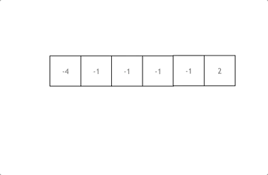

# 题目以及解析

LeetCode：100x

卡码：300x

 

## 目录

### 数据结构

#### 字符串

[1003 - 罗马数字转整数](#p1003)

[1004 - 最长公共前缀](#p1004)

[1005 - 有效的括号](#p1005)

[1009 - 找出字符串中第一个匹配项的下标](#p1009)

[1011 - 最后一个单词的长度](#p1011)

[1013 - 二进制求和](#p1013)

[1029 - 验证回文串](#p1029)

[1036 - 反转字符串](#p1036)

[1037 - 反转字符串 II](<a id="p1037"></a>)

[1039 - 密钥格式化](#p1039)

[1049 - 有效的字母异位](#p1049)

[1053 - 赎金信](#p1053)

[1056 - 反转字符串中的单词](#p1056)

[1057 - 重复的子字符串](#p1057)

[3001 - 替换数字](#p3001)

[3002 -  右旋字符串](#p3002)

[1058 - 删除字符串中的所有相邻重复项](#p1058)


#### 链表

[1006 - 合并两个有序链表](#p1006)

[1016 - 删除排序链表中的重复元素](#p1016)

[1031 - 环形链表](#p1031)

[1043 - 设计链表](#p1043)

[1044 - 反转链表](#p1044)

[1046 - 删除链表的倒数第N个结点](#p1046)

[1047 - 链表相交](#p1047)

[1034 - 两数相加](#p1034)


#### 栈

[1005 - 有效的括号](#p1005)

[1018：二叉树的中序遍历](#p1018)

[1058 - 删除字符串中的所有相邻重复项](#p1058)

[1059 - 逆波兰表达式求值](#p1059)


#### 队列

[1060 - 滑动窗口的最大值](#p1060)


#### 树

[1018 - 二叉树的中序遍历](#p1018)

[1019 - 相同的树](#p1019)

[1020 - 对称二叉树](#p1020)

[1021 - 二叉树的最大深度](#p1021)

[1022 - 将有序数组转换为二叉搜索树](#p1022)

[1023 - 平衡二叉树](#p1023)

[1024 - 二叉树的最小深度](#p1024)

[1025 - 路径总和](#p1025)

[1032 - 二叉树的前序遍历](#p1032)

[1033 - 二叉树的后序遍历](#p1033)

[1062 - 二叉树的层序遍历](#p1062)

[1063 - 二叉树的右视图](#p1063)

[1064 - 二叉树的层平均值](#p1064)

[1065 - N叉树的层序遍历](#p1065)

[1066 - 在每个树行中找最大值](#p1066)

[1067 - 填充每个节点的下一个右侧节点指针](#p1067)

[1068 - 填充每个节点的下一个右侧节点指针 II](#p1068)

[1069 - 翻转二叉树](#p1069)

[1070 - 完全二叉树的节点个数](#p1070)

[1071 - 二叉树的所有路径](#p1071)

[1072 - 左叶子之和](#p1072)

[1073 - 找树左下角的值](#p1073)

[1074 - 路径总和 II](#p1074)

[1075 - 从中序与后序遍历序列构造二叉树](#p1075)

[1076 - 最大二叉树](#p1076)

[1077 - 合并二叉树](#p1077)

[1078 - 二叉搜索树中的搜索](#p1078)

[1079 - 验证二叉搜索树](#p1079)

[1080 - 二叉搜索树的最小绝对差](#p1080)

[1081 - 二叉搜索树中的众数](#p1081)

[1082 - 二叉树的最近公共祖先](#p1082)

[1083 - 二叉搜索树的最近公共祖先](#p1083)

[1084 - 二叉搜索树中的插入操作](#p1084)

[1085 - 删除二叉搜索树中的节点](#p1085)

[1086 - 修建二叉搜索树](#p1086)

[1087 - 把二叉搜索树转换为累加树](#p1087)

[1088 - 二叉搜索树中的插入操作](#p1088)

[1101 - 二叉树的层序遍历 II](#p1101)


#### 哈希表

[1001 - 两数之和](#p1001)

[1003 - 罗马数字转整数](#p1003)

[1049 - 有效的字母异位](#p1049)

[1050 - 两个数组的交集](#p1050)

[1051 - 快乐数](#p1051)

[1052 - 四数相加 II](#p1052)

[1053 - 赎金信](#p1053)

[1061 - 前k个高频元素](#p1061)


### 解题方法

#### 双指针

[1007 - 删除有序数组中的重复项](#p1007)

[1008 - 移除元素](#p1008)

[1009 - 找出字符串中第一个匹配项的下标](#p1009)

[1017 - 合并两个有序数组](#p1017)

[1029 - 验证回文串](#p1029)

[1031 - 环形链表](#p1031)

[1036 - 反转字符串](#p1036)

[1038 - 有序数组的平方](#p1038)

[1046 - 删除链表的倒数第N个结点](#p1046)

[1047 - 链表相交](#p1047)

[1054 - 三数之和](#p1054)

[1055 - 四数之和](#p1055)

[1056 - 反转字符串中的单词](#p1056)


#### 回溯

[1071 - 二叉树的所有路径](#p1071)

[1089 - 组合](#p1089)

[1090 - 组合总和 III](#p1090)

[1091 - 电话号码的字母组合](#p1091)

[1092 - 组合总和](#p1092)

[1093 - 组合总和 II](#p1093)

[1095 - 复原 IP 地址](#p1095)

[1096 - 子集](#p1096)

[1097 - 子集 II](#p1097)

[1098 - 非递减子序列](#p1098)

[1099 - 全排列](#p1099)

[1100 - 全排列 II](#p1100)


#### 动态规划

[1015 - 爬楼梯](#p1015)

[1026 - 杨辉三角](#p1015)

[1027 - 杨辉三角 II](#p1027)

[1028 - 买卖股票的最佳时机](#1028)


#### 递归

[1006 - 合并两个有序链表](#p1006)

[1018 - 二叉树的中序遍历](#p1018)

[1032 - 二叉树的前序遍历](#p1032)

[1033 - 二叉树的后序遍历](#p1033)


#### 二分查找

[1010 - 搜索插入位置](#p1010)

[1014 - x的平方根](#p1014)

[1035 - 二分查找](#p1035)

[1040 - 长度最小的子数组](#p1040)


#### 位运算

[1013 - 二进制求和](#p1013)

[1030：只出现一次的数字](#p1030)


#### 滑动窗口

[1040 - 长度最小的子数组](#p1040)

[1060 - 滑动窗口的最大值]()


#### 前缀和

[1040 - 长度最小的子数组](#p1040)


#### 模拟

[1041 - 螺旋矩阵 II](#p1041)


## 题目列表

### 1001 - 两数之和<a id="p1001"></a>

#### 题目

给定一个整数数组 `nums` 和一个整数目标值 `target`，请你在该数组中找出 **和为目标值** *`target`* 的那 **两个** 整数，并返回它们的数组下标。

你可以假设每种输入只会对应一个答案。但是，数组中同一个元素在答案里不能重复出现。

你可以按任意顺序返回答案。


**示例 1：**

```
输入：nums = [2,7,11,15], target = 9
输出：[0,1]
解释：因为 nums[0] + nums[1] == 9 ，返回 [0, 1] 。
```

**示例 2：**

```
输入：nums = [3,2,4], target = 6
输出：[1,2]
```

**示例 3：**

```
输入：nums = [3,3], target = 6
输出：[0,1]
```


#### 解法

暴力解法

```python
# 双层遍历
# 内部设置判断条件if

from ast import List


class Solution:
    def twoSum(self, nums: List[int], target: int) -> List[int]:
        length = len(nums)
        for i in range(length):
            for j in range(length):
                if nums[i] + nums[j] == target and i != j:
                    return[i,j]
        return[]
    

'''
    列表中的值是可以重复的，去重方法：转为set集合
    对于列表有默认方法len方法：可以获取指定列表的索引长度，获取的值即为列表的元素个数 - 1
    同时存在index方法：获取某个元素在列表中的索引（可指定范围，默认获取第一个相同的值的索引）
'''
```

字典法

```python
class Solution:
    def twoSum(self, nums: List[int], target: int) -> List[int]:
        records = {}
        for index, num in enumerate(nums):
            if (target - num) in records:
                return [index, records[target - num]]
            else:
                records[num] = index
```


### 1002 - 回文数<a id="p1002"></a>

#### 题目

给你一个整数 `x` ，如果 `x` 是一个回文整数，返回 `true` ；否则，返回 `false` 。

回文数是指正序（从左向右）和倒序（从右向左）读都是一样的整数。

- 例如，`121` 是回文，而 `123` 不是。

 

**示例 1：**

```
输入：x = 121
输出：true
```

**示例 2：**

```
输入：x = -121
输出：false
解释：从左向右读, 为 -121 。 从右向左读, 为 121- 。因此它不是一个回文数。
```

**示例 3：**

```
输入：x = 10
输出：false
解释：从右向左读, 为 01 。因此它不是一个回文数。
```


#### 解法

```python
'''
    转换为字符串，比较字符串即可
    问题：内存较大
'''

class Solution:
    def isPalindrome(self, x: int) -> bool:
        if str(x) != reversed(str(x)):
            return False
        else:
            return True
```


### 1003 - 罗马数字转整数<a id="p1003"></a>

#### 题目

罗马数字包含以下七种字符: `I`， `V`， `X`， `L`，`C`，`D` 和 `M`。

```
字符          数值
I             1
V             5
X             10
L             50
C             100
D             500
M             1000
```

例如， 罗马数字 `2` 写做 `II` ，即为两个并列的 1 。`12` 写做 `XII` ，即为 `X` + `II` 。 `27` 写做 `XXVII`, 即为 `XX` + `V` + `II` 。

通常情况下，罗马数字中小的数字在大的数字的右边。但也存在特例，例如 4 不写做 `IIII`，而是 `IV`。数字 1 在数字 5 的左边，所表示的数等于大数 5 减小数 1 得到的数值 4 。同样地，数字 9 表示为 `IX`。这个特殊的规则只适用于以下六种情况：

- `I` 可以放在 `V` (5) 和 `X` (10) 的左边，来表示 4 和 9。
- `X` 可以放在 `L` (50) 和 `C` (100) 的左边，来表示 40 和 90。 
- `C` 可以放在 `D` (500) 和 `M` (1000) 的左边，来表示 400 和 900。

给定一个罗马数字，将其转换成整数。

 

**示例 1:**

```
输入: s = "III"
输出: 3
```

**示例 2:**

```
输入: s = "IV"
输出: 4
```

**示例 3:**

```
输入: s = "IX"
输出: 9
```

**示例 4:**

```
输入: s = "LVIII"
输出: 58
解释: L = 50, V= 5, III = 3.
```

**示例 5:**

```
输入: s = "MCMXCIV"
输出: 1994
解释: M = 1000, CM = 900, XC = 90, IV = 4.
```


#### 解法

```python
'''
    切割字符串
    设置字典
    遍历相加

    问题：如何切割？
    def romanToInt(self, s: str) -> int:
        d = {'I':1, 'IV':3, 'V':5, 'IX':8, 'X':10, 'XL':30, 'L':50, 'XC':80, 'C':100, 'CD':300, 'D':500, 'CM':800, 'M':1000}
        sum = 0
        for i,n in enumerate(s):
        sum += d.get(s[max(i-1, 0):i+1],d[n])
        return sum  

    思想：遍历，对于4、9之类的特殊字符，每次读取两位，如果不能寻找就加当前位
    对于开头存在特殊字符的处理：将特殊字符在字典内的值-1即可，实现对于重复加的处理
'''
class Solution:
    def romanToInt(self, s: str) -> int:
        d = {'I':1, 'IV':3, 'V':5, 'IX':8, 'X':10, 'XL':30, 'L':50, 'XC':80, 'C':100, 'CD':300, 'D':500, 'CM':800, 'M':1000}
        return sum(d.get(s[max(i-1, 0):i+1], d[n]) for i, n in enumerate(s))
```


### 1004 - 最长公共前缀<a id="p1004"></a>

#### 问题

编写一个函数来查找字符串数组中的最长公共前缀。

如果不存在公共前缀，返回空字符串 `""`。

 

**示例 1：**

```
输入：strs = ["flower","flow","flight"]
输出："fl"
```

**示例 2：**

```
输入：strs = ["dog","racecar","car"]
输出：""
解释：输入不存在公共前缀。
```


#### 解法

```python
'''
    对字符串进行遍历
    每次从首字母截取，拓展，一旦不匹配则返回值
'''

class Solution:
    def longestCommonPrefix(self, strs: List[str]) -> str:
        char = ([strs[i] for i in range(len(strs))])

        for x in range(1,len(max(strs,key = len))):
            i = set([str[:x] for str in char])
            if len(i) > 1 and x == 1:
                return ''
            elif len(i) > 1:
                return char[1][:x - 1]
```


### 1005 - 有效的括号<a id="p1005"></a>

#### 问题

给定一个只包括 `'('`，`')'`，`'{'`，`'}'`，`'['`，`']'` 的字符串 `s` ，判断字符串是否有效。

有效字符串需满足：

1. 左括号必须用相同类型的右括号闭合。
2. 左括号必须以正确的顺序闭合。
3. 每个右括号都有一个对应的相同类型的左括号。

 

**示例 1：**

```
输入：s = "()"
输出：true
```

**示例 2：**

```
输入：s = "()[]{}"
输出：true
```

**示例 3：**

```
输入：s = "(]"
输出：false
```


#### 解法

列表天生就是栈，运用栈的思维解决问题

```python
'''
    转为列表
    使用字典 or 列表
    (,[,{,},],)
    回文数问题判断，不符False
'''
class Solution:
    def isValid(self, s: str) -> bool:
        # 简单逻辑判断，如果字符串个数并非偶数则直接不闭合
        if len(s) % 2 != 0:
            print("字符串长度不符合")
            return False
        
        # 创建列表记录括号数目，转为字符串判断回文数，若非回文数直接False
        Valid = [0,0,0,0,0,0]
        for i in s:
            if i == "(":
                Valid[0] += 1
            elif i == "[":
                Valid[1] += 1
            elif i == "{":
                Valid[2] += 1
            elif i == "}":
                Valid[3] += 1
            elif i == "]":
                Valid[4] += 1
            elif i == ")":
                Valid[5] += 1
        if ''.join([str(i) for i in Valid]) != ''.join([str(i) for i in Valid])[::-1]:
            print("逻辑不符合",Valid)
            print(''.join([str(i) for i in Valid]))
            print(reversed(''.join([str(i) for i in Valid])))
            return False
        else:

            print("正确")
            return True

    isValid("([)]",s="([)]")


'''
    以上方法仍然不成熟，使用栈才是最优解
    如何使用栈的思维处理该问题？
    基本操作：进栈 出栈

    栈先入后出特点恰好与本题括号排序特点一致，
    即若遇到左括号入栈，遇到右括号时将对应栈顶左括号出栈，
    则遍历完所有括号后 stack 仍然为空；
'''

class Solution:
    def isValid(self, s: str) -> bool:
        if len(s) % 2 != 0:
            # 字符串的长度不符合偶数
            return False
        dic = {'{': '}',  '[': ']', '(': ')'}
        stack = []
        for c in s:
            # 左括号则入栈
            if c in dic: stack.append(c)
            # 
            elif c != dic[stack.pop()]: 
                return False 
        return len(stack) == 0
```


### 1006 - 合并两个有序链表<a id="p1006"></a>

#### 题目

将两个升序链表合并为一个新的 **升序** 链表并返回。新链表是通过拼接给定的两个链表的所有节点组成的。 

 

**示例 1：**


```
输入：l1 = [1,2,4], l2 = [1,3,4]
输出：[1,1,2,3,4,4]
```

**示例 2：**

```
输入：l1 = [], l2 = []
输出：[]
```

**示例 3：**

```
输入：l1 = [], l2 = [0]
输出：[0]
```


#### 解法

初次解决链表问题，学会使用Python中的链表

```python
'''
    两个链表转化为列表
    直接进行排序
'''

# Definition for singly-linked list.
# class ListNode:
#     def __init__(self, val=0, next=None):
#         self.val = val
#         self.next = next
class Solution:
    def mergeTwoLists(self, list1: Optional[ListNode], list2: Optional[ListNode]) -> Optional[ListNode]:
        result = ListNode()
        tail = result
        while list1 != None and list2 != None:
            if list1.val <= list2.val:
                tail.next = list1
                tail = tail.next
                list1 = list1.next
            else:
                tail.next = list2
                tail = tail.next
                list2 = list2.next
        tail.next = list1 if list1 is not None else list2
        return result.next
```


### 1007 - 删除有序数组中的重复项<a id="p1007"></a>

#### 题目

给你一个 **非严格递增排列** 的数组 `nums` ，请你**[ 原地](http://baike.baidu.com/item/原地算法)** 删除重复出现的元素，使每个元素 **只出现一次** ，返回删除后数组的新长度。元素的 **相对顺序** 应该保持 **一致** 。然后返回 `nums` 中唯一元素的个数。

考虑 `nums` 的唯一元素的数量为 `k` ，你需要做以下事情确保你的题解可以被通过：

- 更改数组 `nums` ，使 `nums` 的前 `k` 个元素包含唯一元素，并按照它们最初在 `nums` 中出现的顺序排列。`nums` 的其余元素与 `nums` 的大小不重要。
- 返回 `k` 。

**判题标准:**

系统会用下面的代码来测试你的题解:

```
int[] nums = [...]; // 输入数组
int[] expectedNums = [...]; // 长度正确的期望答案

int k = removeDuplicates(nums); // 调用

assert k == expectedNums.length;
for (int i = 0; i < k; i++) {
    assert nums[i] == expectedNums[i];
}
```

如果所有断言都通过，那么您的题解将被 **通过**。

 

**示例 1：**

```
输入：nums = [1,1,2]
输出：2, nums = [1,2,_]
解释：函数应该返回新的长度 2 ，并且原数组 nums 的前两个元素被修改为 1, 2 。不需要考虑数组中超出新长度后面的元素。
```

**示例 2：**

```
输入：nums = [0,0,1,1,1,2,2,3,3,4]
输出：5, nums = [0,1,2,3,4]
解释：函数应该返回新的长度 5 ， 并且原数组 nums 的前五个元素被修改为 0, 1, 2, 3, 4 。不需要考虑数组中超出新长度后面的元素。
```


#### 解法

对于列表可以转换为Set集合去重

```python
'''
    去重
    利用Set集合进行去重
    转换为List后再排序
'''
class Solution:
    def removeDuplicates(self, nums) -> int:
        if len(nums)  == 0: 
            return 0
        k =  1
        for  i in range(1, len(nums)):
             if nums[i] != nums[i - 1]:
                nums[k] = nums[i]
                k += 1
        return k
```


### 1008 - 移除元素<a id="p1008"></a>

#### 问题

给你一个数组 `nums` 和一个值 `val`，你需要 **[原地](https://baike.baidu.com/item/原地算法)** 移除所有数值等于 `val` 的元素，并返回移除后数组的新长度。

不要使用额外的数组空间，你必须仅使用 `O(1)` 额外空间并 **[原地 ](https://baike.baidu.com/item/原地算法)修改输入数组**。

元素的顺序可以改变。你不需要考虑数组中超出新长度后面的元素。

 

**说明:**

为什么返回数值是整数，但输出的答案是数组呢?

请注意，输入数组是以**「引用」**方式传递的，这意味着在函数里修改输入数组对于调用者是可见的。

你可以想象内部操作如下:

```
// nums 是以“引用”方式传递的。也就是说，不对实参作任何拷贝
int len = removeElement(nums, val);

// 在函数里修改输入数组对于调用者是可见的。
// 根据你的函数返回的长度, 它会打印出数组中 该长度范围内 的所有元素。
for (int i = 0; i < len; i++) {
    print(nums[i]);
}
```

 

**示例 1：**

```
输入：nums = [3,2,2,3], val = 3
输出：2, nums = [2,2]
解释：函数应该返回新的长度 2, 并且 nums 中的前两个元素均为 2。你不需要考虑数组中超出新长度后面的元素。例如，函数返回的新长度为 2 ，而 nums = [2,2,3,3] 或 nums = [2,2,0,0]，也会被视作正确答案。
```

**示例 2：**

```
输入：nums = [0,1,2,2,3,0,4,2], val = 2
输出：5, nums = [0,1,3,0,4]
解释：函数应该返回新的长度 5, 并且 nums 中的前五个元素为 0, 1, 3, 0, 4。注意这五个元素可为任意顺序。你不需要考虑数组中超出新长度后面的元素。
```


#### 解法

最终返回值是数组的长度

经典问题在于：
对于本体做出的删除操作，如空间复杂度为O(1)
在使用for循环(for i in nums)的条件下，对nums做出更改，实际上会产生错误：即(for i in nums)这一用法的底层实际上依然是(for i in range())

```python
# 朴素解法：计算nums中有多少符合条件的元素，再执行删除
class Solution:
    def removeElement(self, nums: List[int], val: int) -> int:
        numofint = 0
        for i in nums:
            if i == val:
                numofint += 1
        for i in range(numofint):
            nums.remove(val)
        return len(nums)

# 错误解法：对于for循环的使用理解
class Solution:
    def removeElement(self, nums: List[int], val: int) -> int:
        for i in nums:
            if i == val:
                nums.remove(i)
        return len(nums)

# 双指针解法
class Solution:
    def removeElement(self, nums: List[int], val: int) -> int:
        # k =  1
        # for  i in range(1, len(nums)):
        #      if nums[i] != nums[i - 1]:
        #         nums[k] = nums[i]
        #         k += 1
        # return k
        k = 0
        for i in range(len(nums)):
            if nums[i] != val:
                nums[k] = nums[i]
                k += 1
        return len(nums)

# while配合双指针解法，优于for+双指针
class Solution:
    def removeElement(self, nums: List[int], val: int) -> int:
        a = 0
        b = 0
        while a < len(nums):
            if nums[a] != val:
                nums[b] = nums[a]
                b += 1
            a += 1
        return b
    
# 快慢指针
class Solution:
    def removeElement(self, nums: List[int], val: int) -> int:
        # 快慢指针
        fast = 0  # 快指针
        slow = 0  # 慢指针
        size = len(nums)
        while fast < size:  # 不加等于是因为，a = size 时，nums[a] 会越界
            # slow 用来收集不等于 val 的值，如果 fast 对应值不等于 val，则把它与 slow 替换
            if nums[fast] != val:
                nums[slow] = nums[fast]
                slow += 1
            fast += 1
        return slow
```


### 1009 - 找出字符串中第一个匹配项的下标<a id="p1009"></a>

#### 问题

给你两个字符串 `haystack` 和 `needle` ，请你在 `haystack` 字符串中找出 `needle` 字符串的第一个匹配项的下标（下标从 0 开始）。如果 `needle` 不是 `haystack` 的一部分，则返回 `-1` 。

 

**示例 1：**

```
输入：haystack = "sadbutsad", needle = "sad"
输出：0
解释："sad" 在下标 0 和 6 处匹配。
第一个匹配项的下标是 0 ，所以返回 0 。
```

**示例 2：**

```
输入：haystack = "leetcode", needle = "leeto"
输出：-1
解释："leeto" 没有在 "leetcode" 中出现，所以返回 -1 。
```


#### 解法

```python
'''
    字符串可以使用in方法
'''
class Solution:
    def strStr(self, haystack: str, needle: str) -> int:
        if needle not in haystack:
            return -1
        else:
            i = 0
            while True:
                if haystack[i:i + len(needle)] == needle:
                    return i
                i += 1
```


### 1010 - 搜索插入位置<a id="p1010"></a>

#### 问题

给定一个排序数组和一个目标值，在数组中找到目标值，并返回其索引。如果目标值不存在于数组中，返回它将会被按顺序插入的位置。

请必须使用时间复杂度为 `O(log n)` 的算法。

 

**示例 1:**

```
输入: nums = [1,3,5,6], target = 5
输出: 2
```

**示例 2:**

```
输入: nums = [1,3,5,6], target = 2
输出: 1
```

**示例 3:**

```
输入: nums = [1,3,5,6], target = 7
输出: 4
```


#### 解法

调库

```python
class Solution:
    def searchInsert(self, nums: List[int], target: int) -> int:
        for i in nums:
            if target <= i:
                return nums.index(i)
        return len(nums)
```

二分法

问题：为什么最终返回left呢？

答：while循环终止，说明找不到或者已经返回了索引。所以此时left所在的位置就是要插入的位置。

```python
class Solution:
    def searchInsert(self, nums: List[int], target: int) -> int:
        left, right = 0, len(nums) - 1

        while left <= right:
            middle = (left + right) // 2

            if nums[middle] < target:
                left = middle + 1
            elif nums[middle] > target:
                right = middle - 1
            else:
                return middle
        return left
```


### 1011 - 最后一个单词的长度<a id="p1011"></a>

#### 问题

给你一个字符串 `s`，由若干单词组成，单词前后用一些空格字符隔开。返回字符串中 **最后一个** 单词的长度。

**单词** 是指仅由字母组成、不包含任何空格字符的最大子字符串。

 

**示例 1：**

```
输入：s = "Hello World"
输出：5
解释：最后一个单词是“World”，长度为5。
```

**示例 2：**

```
输入：s = "   fly me   to   the moon  "
输出：4
解释：最后一个单词是“moon”，长度为4。
```

**示例 3：**

```
输入：s = "luffy is still joyboy"
输出：6
解释：最后一个单词是长度为6的“joyboy”。
```


#### 解法

```python
class Solution:
    def lengthOfLastWord(self, s: str) -> int:
        return len(s.split()[-1])
```


### 1012 - 加一<a id="p1012"></a>

#### 问题

给定一个由 **整数** 组成的 **非空** 数组所表示的非负整数，在该数的基础上加一。

最高位数字存放在数组的首位， 数组中每个元素只存储**单个**数字。

你可以假设除了整数 0 之外，这个整数不会以零开头。

 

**示例 1：**

```
输入：digits = [1,2,3]
输出：[1,2,4]
解释：输入数组表示数字 123。
```

**示例 2：**

```
输入：digits = [4,3,2,1]
输出：[4,3,2,2]
解释：输入数组表示数字 4321。
```

**示例 3：**

```
输入：digits = [0]
输出：[1]
```


#### 解法

```python
# 列表为主体
class Solution:
    def plusOne(self, digits: List[int]) -> List[int]:
        if digits[-1] != 9:
            digits[-1] += 1
        else
            
        return digits
    
# 数据为主题
class Solution:
    def plusOne(self, digits: List[int]) -> List[int]:
        # 计算出该数字为多少:列表字符串转数字
        nums = ""
        while digits:
            nums = nums + str(digits.pop(0))
        nums = int(nums) + 1
        return [int(x) for x in str(nums)]
```


### 1013 - 二进制求和<a id="p1013"></a>

#### 问题

给你两个二进制字符串 `a` 和 `b` ，以二进制字符串的形式返回它们的和。

 

**示例 1：**

```
输入:a = "11", b = "1"
输出："100"
```

**示例 2：**

```
输入：a = "1010", b = "1011"
输出："10101"
```


#### 解法

```python
class Solution:
    def addBinary(self, a: str, b: str) -> str:
        return bin(int(a, 2) + int(b, 2))[2:]
```


### 1014 - x的平方根<a id="p1014"></a>

#### 问题

给你一个非负整数 `x` ，计算并返回 `x` 的 **算术平方根** 。

由于返回类型是整数，结果只保留 **整数部分** ，小数部分将被 **舍去 。**

**注意：**不允许使用任何内置指数函数和算符，例如 `pow(x, 0.5)` 或者 `x ** 0.5` 。

 

**示例 1：**

```
输入：x = 4
输出：2
```

**示例 2：**

```
输入：x = 8
输出：2
解释：8 的算术平方根是 2.82842..., 由于返回类型是整数，小数部分将被舍去。
```


#### 解法

```python
import math
class Solution:
    def mySqrt(self, x: int) -> int:
        return math.trunc(math.sqrt(x))
```


### 1015 - 爬楼梯<a id="p1015"></a>

#### 问题

假设你正在爬楼梯。需要 `n` 阶你才能到达楼顶。

每次你可以爬 `1` 或 `2` 个台阶。你有多少种不同的方法可以爬到楼顶呢？

 

**示例 1：**

```
输入：n = 2
输出：2
解释：有两种方法可以爬到楼顶。
1. 1 阶 + 1 阶
2. 2 阶
```

**示例 2：**

```
输入：n = 3
输出：3
解释：有三种方法可以爬到楼顶。
1. 1 阶 + 1 阶 + 1 阶
2. 1 阶 + 2 阶
3. 2 阶 + 1 阶
```


#### 解法

该题目涉及动态规划
使用数学思维：联想到斐波那契数列
建立数学函数：若爬上n层台阶，有f(n)种方法
其最后一次跳跃只有两种方法：跳一步和跳两步
所以f(n) = f(n - 1) + f(n - 2)
对于起步，很容易计算f(0) = 1,f(1) = 1
叠加即可计算

```python
class Solution:
    def climbStairs(self, n: int) -> int:
        a , b = 1 , 1
        for _ in range(n - 1):
            a , b = b , a + b
        return b
```


### 1016 - 删除排序链表中的重复元素<a id="p1016"></a>

#### 问题

给定一个已排序的链表的头 `head` ， *删除所有重复的元素，使每个元素只出现一次* 。返回 *已排序的链表* 。

 

**示例 1：**


```
输入：head = [1,1,2]
输出：[1,2]
```

**示例 2：**


```
输入：head = [1,1,2,3,3]
输出：[1,2,3]
```


#### 解法

非双指针解法，思想一致，但是少开辟了空间，节省了内存

注意：要正确的判断条件，且考虑周全

```python
# Definition for singly-linked list.
# class ListNode:
#     def __init__(self, val=0, next=None):
#         self.val = val
#         self.next = next
class Solution:
    def deleteDuplicates(self, head: Optional[ListNode]) -> Optional[ListNode]:
        if not head:
            return head
        target = head
        while head and head.next:
            if head.val == head.next.val:
                head.next = head.next.next
            else:
                head = head.next
        return target
```

双指针解法

```python
class Solution:
    def deleteDuplicates(self, head: Optional[ListNode]) -> Optional[ListNode]:
        if head == None:
            return head
        p = head
        q = p.next
        while q:
            if p.val == q.val:
                if q.next == None:
                    p.next = None
                    return head
                q = q.next
                p.next = q
            else:
                p = q
                q = q.next
        return head
```


### 1017 - 合并两个有序数组<a id="p1017"></a>

#### 问题

给你两个按 **非递减顺序** 排列的整数数组 `nums1` 和 `nums2`，另有两个整数 `m` 和 `n` ，分别表示 `nums1` 和 `nums2` 中的元素数目。

请你 **合并** `nums2` 到 `nums1` 中，使合并后的数组同样按 **非递减顺序** 排列。

**注意：**最终，合并后数组不应由函数返回，而是存储在数组 `nums1` 中。为了应对这种情况，`nums1` 的初始长度为 `m + n`，其中前 `m` 个元素表示应合并的元素，后 `n` 个元素为 `0` ，应忽略。`nums2` 的长度为 `n` 。

 

**示例 1：**

```
输入：nums1 = [1,2,3,0,0,0], m = 3, nums2 = [2,5,6], n = 3
输出：[1,2,2,3,5,6]
解释：需要合并 [1,2,3] 和 [2,5,6] 。
合并结果是 [1,2,2,3,5,6] ，其中斜体加粗标注的为 nums1 中的元素。
```

**示例 2：**

```
输入：nums1 = [1], m = 1, nums2 = [], n = 0
输出：[1]
解释：需要合并 [1] 和 [] 。
合并结果是 [1] 。
```

**示例 3：**

```
输入：nums1 = [0], m = 0, nums2 = [1], n = 1
输出：[1]
解释：需要合并的数组是 [] 和 [1] 。
合并结果是 [1] 。
注意，因为 m = 0 ，所以 nums1 中没有元素。nums1 中仅存的 0 仅仅是为了确保合并结果可以顺利存放到 nums1 中。
```


#### 解法

```python
class Solution:
    def merge(self, nums1: List[int], m: int, nums2: List[int], n: int) -> None:
        """
        Do not return anything, modify nums1 in-place instead.
        """
        # 覆盖方法
        # for i in range(m,m + n):
        #     nums1[i] = nums2[i - m]
        # nums1.sort()

        # 双指针
        k = m - 1
        l = n - 1
        x = m + n - 1
        while k >= 0 and l >= 0:
            if nums1[k] >= nums2[l]:
                nums1[x] = nums1[k]
                k -= 1
            else:
                nums1[x] = nums2[l]
                l -= 1
            x -= 1
        while l >= 0:
            nums1[x] = nums2[l]
            l -= 1
            x -= 1 
```


### 1018 - 二叉树的中序遍历<a id="p1018"></a>

#### 问题

给定一个二叉树的根节点 `root` ，返回 *它的 **中序** 遍历* 。

 

**示例 1：**


```
输入：root = [1,null,2,3]
输出：[1,3,2]
```

**示例 2：**

```
输入：root = []
输出：[]
```

**示例 3：**

```
输入：root = [1]
输出：[1]
```


#### 解法

方法一：使用递归方法

```python
# Definition for a binary tree node.
# class TreeNode:
#     def __init__(self, val=0, left=None, right=None):
#         self.val = val
#         self.left = left
#         self.right = right
class Solution:
    def inorderTraversal(self, root: Optional[TreeNode]) -> List[int]:
        if not root:
            return []
        result = []
        def demo(target:Optional[TreeNode]):
            if target:
                demo(target.left)
                result.append(target.val)
                demo(target.right)
        demo(root)
        return result
```

方法二：使用迭代解法

```python
class Solution:
    def inorderTraversal(self, root: Optional[TreeNode]) -> List[int]:
        if not root:
            return []
        temp = []
        result = []
        while root or temp:
            if root:
                temp.append(root)
                root = root.left
            else:
                temp1 = temp.pop()
                result.append(temp1.val)
                root = temp1.right
        return result
```

方法三：使用迭代模板

```python
class Solution:
    def inorderTraversal(self, root: TreeNode) -> List[int]:
        result = []
        st = []
        if root:
            st.append(root)
        while st:
            node = st.pop()
            if node != None:
                if node.right: #添加右节点（空节点不入栈）
                    st.append(node.right)
                
                st.append(node) #添加中节点
                st.append(None) #中节点访问过，但是还没有处理，加入空节点做为标记。
                
                if node.left: #添加左节点（空节点不入栈）
                    st.append(node.left)
            else: #只有遇到空节点的时候，才将下一个节点放进结果集
                node = st.pop() #重新取出栈中元素
                result.append(node.val) #加入到结果集
        return result
```


### 1019 - 相同的树<a id="p1019"></a>

#### 问题

给你两棵二叉树的根节点 `p` 和 `q` ，编写一个函数来检验这两棵树是否相同。

如果两个树在结构上相同，并且节点具有相同的值，则认为它们是相同的。

 

**示例 1：**


```
输入：p = [1,2,3], q = [1,2,3]
输出：true
```

**示例 2：**


```
输入：p = [1,2], q = [1,null,2]
输出：false
```

**示例 3：**


```
输入：p = [1,2,1], q = [1,1,2]
输出：false
```


#### 解法

```python
# Definition for a binary tree node.
# class TreeNode:
#     def __init__(self, val=0, left=None, right=None):
#         self.val = val
#         self.left = left
#         self.right = right
class Solution:
    def isSameTree(self, p: Optional[TreeNode], q: Optional[TreeNode]) -> bool:
        if not q and not p:
            return True
        if not p or not q:
            return False
        return p.val == q.val and self.isSameTree(p.right,q.right) and self.isSameTree(p.left,q.left)
```


### 1020 - 对称二叉树<a id="p1020"></a>

#### 问题

给你一个二叉树的根节点 `root` ， 检查它是否轴对称。

 

**示例 1：**


```
输入：root = [1,2,2,3,4,4,3]
输出：true
```

**示例 2：**


```
输入：root = [1,2,2,null,3,null,3]
输出：false
```


#### 解法

递归

```python
class Solution:
    def judge(self,rootleft:Optional[TreeNode],rootright:Optional[TreeNode]) -> bool:
            if not rootleft and not rootright:
                return True
            if not rootleft or not rootright:
                return False
            if rootleft.val != rootright.val:
                return False
            else:
                return self.judge(rootleft.left,rootright.right) and self.judge(rootleft.right,rootright.left)
            return True
    def isSymmetric(self, root: Optional[TreeNode]) -> bool:
        return self.judge(root.left,root.right)
```

迭代

```python
class Solution:
    def isSymmetric(self, root: Optional[TreeNode]) -> bool:
        from collections import deque
        deque = collections.deque()
        deque.append(root.left)
        deque.append(root.right)
        while deque:
            left = deque.popleft()
            right = deque.popleft()
            if not left and not right: #左节点为空、右节点为空，此时说明是对称的
                continue
            #左右一个节点不为空，或者都不为空但数值不相同，返回false
            if not left or not right or left.val != right.val:
                return False
            deque.append(left.left)
            deque.append(right.right)
            deque.append(left.right)
            deque.append(right.left)
        return True
```


### 1021 - 二叉树的最大深度<a id="p1021"></a>

#### 问题

给定一个二叉树 `root` ，返回其最大深度。

二叉树的 **最大深度** 是指从根节点到最远叶子节点的最长路径上的节点数。

 

**示例 1：**


 

```
输入：root = [3,9,20,null,null,15,7]
输出：3
```

**示例 2：**

```
输入：root = [1,null,2]
输出：2
```


#### 解法

递归解法

```python
# Definition for a binary tree node.
# class TreeNode:
#     def __init__(self, val=0, left=None, right=None):
#         self.val = val
#         self.left = left
#         self.right = right
class Solution:
    def Judge(self, root) -> int:
        if not root:
            return 0
        elif not root.left and not root.right:
            return 1
        elif root.left and root.right:
            return max(1 + self.Judge(root.left),1 + self.Judge(root.right))
        elif root.left or root.right:
            return max((1 + self.Judge(root.left)),(1 + self.Judge(root.right)))
    def maxDepth(self, root: Optional[TreeNode]) -> int:
        return self.Judge(root)
```

使用模板解法

```python
class Solution:
    def maxDepth(self, root: TreeNode) -> int:
        if not root:
            return 0
        
        depth = 0
        queue = collections.deque([root])
        
        while queue:
            depth += 1
            for _ in range(len(queue)):
                node = queue.popleft()
                if node.left:
                    queue.append(node.left)
                if node.right:
                    queue.append(node.right)
        
        return depth
```


### 1022 - 将有序数组转换为二叉搜索树<a id="p1022"></a>

#### 问题

给你一个整数数组 `nums` ，其中元素已经按 **升序** 排列，请你将其转换为一棵 **高度平衡** 二叉搜索树。

**高度平衡** 二叉树是一棵满足「每个节点的左右两个子树的高度差的绝对值不超过 1 」的二叉树。

 

**示例 1：**


```
输入：nums = [-10,-3,0,5,9]
输出：[0,-3,9,-10,null,5]
解释：[0,-10,5,null,-3,null,9] 也将被视为正确答案：
```

**示例 2：**


```
输入：nums = [1,3]
输出：[3,1]
解释：[1,null,3] 和 [3,1] 都是高度平衡二叉搜索树。
```


#### 解法

递归创建二叉树，难点在于要平衡，所以要均分左右

其实只要每次寻找中间值就好

精妙之处在于无论奇数偶数，计算出的中间节点都是一样的：四舍五入；比如6和7

```python
# Definition for a binary tree node.
# class TreeNode:
#     def __init__(self, val=0, left=None, right=None):
#         self.val = val
#         self.left = left
#         self.right = right
class Solution:
    def sortedArrayToBST(self, nums: List[int]) -> Optional[TreeNode]:
        lenth = len(nums)
        # 二叉搜索树，左子树比根节点小，右子树比根节点大
        # 每次二分 递归
        # 创建二叉树
        def createTree(l , r) -> Optional[TreeNode]:
            if l > r:
                return None
            mid = (l + r) // 2
            tree = TreeNode(nums[mid])
            tree.left = createTree(l,mid - 1)
            tree.right = createTree(mid + 1,r)
            return tree
        return createTree(0,lenth - 1)
```


### 1023 - 平衡二叉树<a id="p1023"></a>

#### 问题

给定一个二叉树，判断它是否是高度平衡的二叉树。

本题中，一棵高度平衡二叉树定义为：

> 一个二叉树*每个节点* 的左右两个子树的高度差的绝对值不超过 1 。

 

**示例 1：**


```
输入：root = [3,9,20,null,null,15,7]
输出：true
```

**示例 2：**


```
输入：root = [1,2,2,3,3,null,null,4,4]
输出：false
```

**示例 3：**

```
输入：root = []
输出：true
```


#### 解法

普通方法：

lenth方法用来计算树的深度

再判断左右树的深度差绝对值即可。

```python
# Definition for a binary tree node.
# class TreeNode:
#     def __init__(self, val=0, left=None, right=None):
#         self.val = val
#         self.left = left 
#         self.right = right
class Solution:
    def isBalanced(self, root: Optional[TreeNode]) -> bool:
        # 判断的是每个节点的左右子树的高度差
        # 而不是整棵树最高节点和最低节点的高度差
        # 将树分为左右，判断左右即可
        def lenth(root) -> int:
            if not root:
                return 0
            elif not root.left and not root.right:
                return 1
            elif root.left and root.right:
                return max(1 + lenth(root.left),1 + lenth(root.right))
            elif root.left or root.right:
                return max((1 + lenth(root.left)),(1 + lenth(root.right)))
        def Judge(root):
            if not root or (not root.left and not root.right):
                return True
            if abs(lenth(root.left) - lenth(root.right)) > 1:
                return False
            else:
                return Judge(root.left) and Judge(root.right)
        return Judge(root)
```

剪枝法：

该方法即使用了最简单的方法统计了树的高度，同时还可以判定树是否为平衡二叉树。

对于recur函数，其有两个作用：1.探查树的深度 2.判断树是否为平衡树

关于其第一个作用不做解释，就是判断深度。

但是其第二个作用的实现，很为精妙：首先，`if left == -1: return -1`和`if right == -1: return -1`两句，实现的功能是，一旦发现有不平衡的部分，则全局返回-1来判断此树不是平衡树；其次，其每次探查完左右子树的长度后立即比对是否为平衡树，可以立即返回结果；最后，这种极为巧妙地层级设计帮助一旦遇到非平衡情况能全局返回最终结果。

对待这个函数要全局来看：仅从第一层来看的话，其比较的是左右两侧的最大值的长度，直觉上不能比较是否平衡，但是实际上，其完全遍历了树的左右，是正确的。

```python
class Solution:
    def isBalanced(self, root: Optional[TreeNode]) -> bool:
        def recur(root):
            if not root: return 0
            left = recur(root.left)
            if left == -1: return -1
            right = recur(root.right)
            if right == -1: return -1
            return max(left, right) + 1 if abs(left - right) <= 1 else -1

        return recur(root) != -1
```


### 1024 - 二叉树的最小深度<a id="p1024"></a>

#### 问题

给定一个二叉树，找出其最小深度。

最小深度是从根节点到最近叶子节点的最短路径上的节点数量。

**说明：**叶子节点是指没有子节点的节点。

 

**示例 1：**


```
输入：root = [3,9,20,null,null,15,7]
输出：2
```

**示例 2：**

```
输入：root = [2,null,3,null,4,null,5,null,6]
输出：5
```


#### 解法

递归：

整棵树遍历返回最小深度

```python
# Definition for a binary tree node.
# class TreeNode:
#     def __init__(self, val=0, left=None, right=None):
#         self.val = val
#         self.left = left
#         self.right = right
class Solution:
    def minDepth(self, root: Optional[TreeNode]) -> int:
        if not root:
            return 0
        elif not root.left and not root.right:
            return 1
        elif not root.left:
            return self.minDepth(root.right) + 1
        elif not root.right:
            return self.minDepth(root.left) + 1
        else:
            return min(self.minDepth(root.right) + 1,self.minDepth(root.left) + 1)
        return self.minDepth(root) + 1
```

迭代：

该迭代方法中，使用了栈（列表）储存元组的方法，每次读取列表中最后的元组，来记录深度和节点对象（中间值）。

直到最先找到某个节点是叶子节点即可：最先找到的必定最小。

```python
class Solution:
    def minDepth(self, root):
        if not root:
            return 0
        
        deque = []
        deque.append((1, root))
        
        while deque:
            depth, root = deque.pop(0) 
            # 判断是否是叶子节点
            if not root.left and not root.right:
                return depth    
            # 非空记录节点+深度
            if root.left:deque.append((depth+1, root.left))
            if root.right:deque.append((depth+1, root.right))
```

模板

```python
class Solution:
    def minDepth(self, root):
        if not root:
        	return 0
        from collections import deque
        deque = collections.deque([root])
        result = 0
        while deque:
            result += 1
            for _ in range(len(deque)):
                node = deque.popleft()
                if not node.left and not node.right:
                    return result
                if node.left:
                    deque.append(node.left)
                if node.right:
                    deque.append(node.right)
```


### 1025 - 路径总和<a id="p1025"></a>

#### 问题

给你二叉树的根节点 `root` 和一个表示目标和的整数 `targetSum` 。判断该树中是否存在 **根节点到叶子节点** 的路径，这条路径上所有节点值相加等于目标和 `targetSum` 。如果存在，返回 `true` ；否则，返回 `false` 。

**叶子节点** 是指没有子节点的节点。

 

**示例 1：**


```
输入：root = [5,4,8,11,null,13,4,7,2,null,null,null,1], targetSum = 22
输出：true
解释：等于目标和的根节点到叶节点路径如上图所示。
```

**示例 2：**


```
输入：root = [1,2,3], targetSum = 5
输出：false
解释：树中存在两条根节点到叶子节点的路径：
(1 --> 2): 和为 3
(1 --> 3): 和为 4
不存在 sum = 5 的根节点到叶子节点的路径。
```

**示例 3：**

```
输入：root = [], targetSum = 0
输出：false
解释：由于树是空的，所以不存在根节点到叶子节点的路径。
```


#### 解法

递归，找到某个路径的节点总和是否为某个特定值，可以将问题转化为是否有一条路可以在到达叶子节点的时候将目标值减为0。

```python
# Definition for a binary tree node.
# class TreeNode:
#     def __init__(self, val=0, left=None, right=None):
#         self.val = val
#         self.left = left
#         self.right = right
class Solution:
    def hasPathSum(self, root: Optional[TreeNode], targetSum: int) -> bool:
        if not root:
            return False
        else:
            if root.left and root.right:
                return self.hasPathSum(root.left, targetSum - root.val) or self.hasPathSum(root.right, targetSum - root.val)
            elif not root.left and not root.right and targetSum - root.val == 0:
                return True
            else:
                return self.hasPathSum(root.left, targetSum - root.val) if root.left else self.hasPathSum(root.right, targetSum - root.val)
```

递归精简

```python
class Solution:
    def hasPathSum(self, root: Optional[TreeNode], targetSum: int) -> bool:
        if not root:
            return False
        if not root.left and not root.right and targetSum == root.val:
            return True
        return self.hasPathSum(root.left, targetSum - root.val) or self.hasPathSum(root.right, targetSum - root.val)
```

迭代

```python
class Solution:
    def hasPathSum(self, root: TreeNode, sum: int) -> bool:
        if not root:
            return False
        # 此时栈里要放的是pair<节点指针，路径数值>
        st = [(root, root.val)]
        while st:
            node, path_sum = st.pop()
            # 如果该节点是叶子节点了，同时该节点的路径数值等于sum，那么就返回true
            if not node.left and not node.right and path_sum == sum:
                return True
            # 右节点，压进去一个节点的时候，将该节点的路径数值也记录下来
            if node.right:
                st.append((node.right, path_sum + node.right.val))
            # 左节点，压进去一个节点的时候，将该节点的路径数值也记录下来
            if node.left:
                st.append((node.left, path_sum + node.left.val))
        return False
```


### 1026 - 杨辉三角<a id="p1026"></a>

#### 问题

给定一个非负整数 *`numRows`，*生成「杨辉三角」的前 *`numRows`* 行。

在「杨辉三角」中，每个数是它左上方和右上方的数的和。


 

**示例 1:**

```
输入: numRows = 5
输出: [[1],[1,1],[1,2,1],[1,3,3,1],[1,4,6,4,1]]
```

**示例 2:**

```
输入: numRows = 1
输出: [[1]]
```


#### 解法

杨辉三角的一个特点是：左右恒为1

而且其某层的元素就是上一个列表的相邻值相加得来，所以核心代码在于根据上一层计算出下一层

有意思的是：解决杨辉三角每层左右都是1的方法是先添加1，执行完核心代码再添加1

```python
class Solution:
    def generate(self, numRows: int) -> List[List[int]]:
        # 最左和最右 + 1
        # 每次将上层列表的值 求和
        result = [[1]]
        for i in range(1, numRows):
            temp = [1]
            # 获取上层列表
            last_lst = result[i - 1]
            for j in range(1, len(last_lst)):
                temp.append(last_lst[j] + last_lst[j - 1])
            temp.append(1)
            result.append(temp)
        return result
```


### 1027 - 杨辉三角 II<a id="p1027"></a>

#### 问题

给定一个非负索引 `rowIndex`，返回「杨辉三角」的第 `rowIndex` 行。

在「杨辉三角」中，每个数是它左上方和右上方的数的和。


 

**示例 1:**

```
输入: rowIndex = 3
输出: [1,3,3,1]
```

**示例 2:**

```
输入: rowIndex = 0
输出: [1]
```

**示例 3:**

```
输入: rowIndex = 1
输出: [1,1]
```


#### 解法

比上一题多计算一层并返回最后一层即可

```python
class Solution:
    def getRow(self, rowIndex: int) -> List[int]:
        # 最左和最右 + 1
        # 每次将上层列表的值 求和
        result = [[1]]
        for i in range(1, rowIndex + 1):
            temp = [1]
            # 获取上层列表
            last_lst = result[i - 1]
            for j in range(1, len(last_lst)):
                temp.append(last_lst[j] + last_lst[j - 1])
            temp.append(1)
            result.append(temp)
        return result[-1]
```


### 1028 - 买卖股票的最佳时机<a id="p1028"></a>

#### 问题

给定一个数组 `prices` ，它的第 `i` 个元素 `prices[i]` 表示一支给定股票第 `i` 天的价格。

你只能选择 **某一天** 买入这只股票，并选择在 **未来的某一个不同的日子** 卖出该股票。设计一个算法来计算你所能获取的最大利润。

返回你可以从这笔交易中获取的最大利润。如果你不能获取任何利润，返回 `0` 。

 

**示例 1：**

```
输入：[7,1,5,3,6,4]
输出：5
解释：在第 2 天（股票价格 = 1）的时候买入，在第 5 天（股票价格 = 6）的时候卖出，最大利润 = 6-1 = 5 。
     注意利润不能是 7-1 = 6, 因为卖出价格需要大于买入价格；同时，你不能在买入前卖出股票。
```

**示例 2：**

```
输入：prices = [7,6,4,3,1]
输出：0
解释：在这种情况下, 没有交易完成, 所以最大利润为 0。
```


#### 解法

本题暴力解法最简单，但是很容易超时

方法一：很好理解，每次记录自遍历开始的最低价格和最大差值

其中，先获得最低价格后再计算最大差值，可以保证永远不会减出负数，避免了高买低出

方法二：方法二精髓在于相较于方法一减小了计算量，其核心思想是，假设第一天为最低价格，向后遍历，遇到更低的价格就将更新最低价格，遇到不是最低的价格就直接使用今日价格减最低价格获得答案，答案随着遍历更新。

至于其减少的计算量就是：方法一在最低价格更新后还会相减一次，结果必为0，没有意义。

```python
# class Solution:
#     def maxProfit(self, prices: List[int]) -> int:
#         # 锚定某天买入，推以后最大值卖出
#         # 暴力解法：超时
#         lenth = len(prices)
#         lst = []
#         for i in range(lenth):
#             lst.append(max(prices[j] for j in range(i, lenth)) - prices[i])
#         return max(lst)

# 方法一
class Solution:
    def maxProfit(self, prices: List[int]) -> int:
        if not prices:
            return 0
        minprice = prices[0]
        maxprofit = 0
        for price in prices:
            minprice = min(minprice, price)
            maxprofit = max(maxprofit, price - minprice)
        return maxprofit

# 方法二
class Solution:
    def maxProfit(self, prices: List[int]) -> int:
        if not prices:
            return 0
        ans=0
        curmin=prices[0]
        for i,v in enumerate(prices):
            if v<curmin:
                curmin=v
            else:
                ans=max(ans, v-curmin)
        return ans
```


### 1029 - 验证回文串<a id="p1029"></a>

#### 问题

如果在将所有大写字符转换为小写字符、并移除所有非字母数字字符之后，短语正着读和反着读都一样。则可以认为该短语是一个 **回文串** 。

字母和数字都属于字母数字字符。

给你一个字符串 `s`，如果它是 **回文串** ，返回 `true` ；否则，返回 `false` 。

 

**示例 1：**

```
输入: s = "A man, a plan, a canal: Panama"
输出：true
解释："amanaplanacanalpanama" 是回文串。
```

**示例 2：**

```
输入：s = "race a car"
输出：false
解释："raceacar" 不是回文串。
```

**示例 3：**

```
输入：s = " "
输出：true
解释：在移除非字母数字字符之后，s 是一个空字符串 "" 。
由于空字符串正着反着读都一样，所以是回文串。
```


#### 解法

两种方法区别在于如何校验是否是回文串

目前调库快于双指针

```python
class Solution:
    def isPalindrome(self, s: str) -> bool:
        # 调库高手:更快
        # 处理字符串：根据ASCII码，只加入字母，对大写字母处理
        lst = []
        for i in s:
            if (ord(i) >= 97 and ord(i) <= 122) or (ord(i) >= 48 and ord(i) <= 57):
                lst.append(i)
            elif ord(i) >= 65 and ord(i) <= 90:
                lst.append(chr(ord(i) + 32))
        
        new_s = "".join(lst)
        return new_s == new_s[::-1]

        # 双指针
        lst = []
        for i in s:
            if (ord(i) >= 97 and ord(i) <= 122) or (ord(i) >= 48 and ord(i) <= 57):
                lst.append(i)
            elif ord(i) >= 65 and ord(i) <= 90:
                lst.append(chr(ord(i) + 32))

        lenth = len(lst)
        for i in range(lenth // 2):
            if lst[i] == lst[lenth - 1]:
                lenth -= 1
            else:
                return False
        return True
```


### 1030 - 只出现一次的数字<a id="p1030"></a>

#### 问题

给你一个 **非空** 整数数组 `nums` ，除了某个元素只出现一次以外，其余每个元素均出现两次。找出那个只出现了一次的元素。

你必须设计并实现线性时间复杂度的算法来解决此问题，且该算法只使用常量额外空间。

 

**示例 1 ：**

```
输入：nums = [2,2,1]
输出：1
```

**示例 2 ：**

```
输入：nums = [4,1,2,1,2]
输出：4
```

**示例 3 ：**

```
输入：nums = [1]
输出：1
```


#### 解法

位运算：对二进制形式的数字进行位运算，如果两个数字相同则返回0，如果不同则返回两个二进制数的不同之处（由两个二进制数字的1填充）

异或运算的精髓在于：其符合交换律，比如a ^ b = b ^ a。

对于本题目而言：若出现数组[2, 2, 1, 4, 4]，无需在意1 ^ 4的结果，因为最后其还要有1 ^ 4 ^ 4 运算，最终结果还是1。

```python
class Solution:
    def singleNumber(self, nums: List[int]) -> int:
        # 暴力破解
        # 10%
        lenth = len(nums)
        if lenth == 1:
            return nums[0]
        lst = []
        for i in range(lenth):
            if nums[i] not in lst:
                lst.append(nums[i])
            else:
                lst.remove(nums[i])
        return lst[0]

        # 位运算
        lenth = len(nums)
        if lenth == 1: return nums[0]
        result = nums[0]
        for i in range(1, lenth):
            result = result ^ nums[i]
        return result
```


### 1031 - 环形链表<a id="p1031"></a>

#### 问题

给你一个链表的头节点 `head` ，判断链表中是否有环。

如果链表中有某个节点，可以通过连续跟踪 `next` 指针再次到达，则链表中存在环。 为了表示给定链表中的环，评测系统内部使用整数 `pos` 来表示链表尾连接到链表中的位置（索引从 0 开始）。**注意：`pos` 不作为参数进行传递** 。仅仅是为了标识链表的实际情况。

*如果链表中存在环* ，则返回 `true` 。 否则，返回 `false` 。

 

**示例 1：**


```
输入：head = [3,2,0,-4], pos = 1
输出：true
解释：链表中有一个环，其尾部连接到第二个节点。
```

**示例 2：**


```
输入：head = [1,2], pos = 0
输出：true
解释：链表中有一个环，其尾部连接到第一个节点。
```

**示例 3：**


```
输入：head = [1], pos = -1
输出：false
解释：链表中没有环。
```


#### 解法

暴力解法：数据量有范围，选最大范围处理即可。

双指针解法：快的指针终将追上慢的指针，它们之间的相对距离以1的距离缩减。

```python
# Definition for singly-linked list.
# class ListNode:
#     def __init__(self, x):
#         self.val = x
#         self.next = None

# 暴力解法
class Solution:
    def hasCycle(self, head: Optional[ListNode]) -> bool:
        index = 0
        while index < 10001:
            if not head:
                return False
            head = head.next
            index += 1
        return True

# 快慢指针：快的指针必定会追上慢的指针
class Solution:
    def hasCycle(self, head: Optional[ListNode]) -> bool:
        slow = fast = head
        while fast:
            if fast.next:
                fast = fast.next.next
            else:
                break
            slow = slow.next
            if fast == slow:
                return True
        return False
```


### 1032 - 二叉树的前序遍历<a id="p1032"></a>

#### 问题

给你二叉树的根节点 `root` ，返回它节点值的 **前序** 遍历。

 

**示例 1：**


```
输入：root = [1,null,2,3]
输出：[1,2,3]
```

**示例 2：**

```
输入：root = []
输出：[]
```

**示例 3：**

```
输入：root = [1]
输出：[1]
```

**示例 4：**


```
输入：root = [1,2]
输出：[1,2]
```

**示例 5：**


```
输入：root = [1,null,2]
输出：[1,2]
```

 

**提示：**

- 树中节点数目在范围 `[0, 100]` 内
- `-100 <= Node.val <= 100`

 

**进阶：**递归算法很简单，你可以通过迭代算法完成吗？


#### 解法

递归

```python
# Definition for a binary tree node.
# class TreeNode:
#     def __init__(self, val=0, left=None, right=None):
#         self.val = val
#         self.left = left
#         self.right = right
class Solution:
    def preorderTraversal(self, root: Optional[TreeNode]) -> List[int]:
        result = []
        def preorder(root: Optional[TreeNode]):
            if not root:
                return
            result.append(root.val)
            preorder(root.left)
            preorder(root.right)
        preorder(root)
        return result
```

使用递归模板

```python
class Solution:
    def preorderTraversal(self, root: TreeNode) -> List[int]:
        result = []
        st= []
        if root:
            st.append(root)
        while st:
            node = st.pop()
            if node != None:
                if node.right: #右
                    st.append(node.right)
                if node.left: #左
                    st.append(node.left)
                st.append(node) #中
                st.append(None)
            else:
                node = st.pop()
                result.append(node.val)
        return result
```


### 1033 - 二叉树的后序遍历<a id="p1033"></a>

#### 问题

给你一棵二叉树的根节点 `root` ，返回其节点值的 **后序遍历** 。

 

**示例 1：**


```
输入：root = [1,null,2,3]
输出：[3,2,1]
```

**示例 2：**

```
输入：root = []
输出：[]
```

**示例 3：**

```
输入：root = [1]
输出：[1]
```

 

**提示：**

- 树中节点的数目在范围 `[0, 100]` 内
- `-100 <= Node.val <= 100`

 

**进阶：**递归算法很简单，你可以通过迭代算法完成吗？


#### 解法

递归

```python
# Definition for a binary tree node.
# class TreeNode:
#     def __init__(self, val=0, left=None, right=None):
#         self.val = val
#         self.left = left
#         self.right = right
class Solution:
    def postorderTraversal(self, root: Optional[TreeNode]) -> List[int]:
        lst = []
        def posoder(root: Optional[TreeNode]):
            if root and root.left:
                posoder(root.left)
            if root and root.right:
                posoder(root.right)
            if root:
                lst.append(root.val)
        posoder(root)
        return lst
```

迭代模板

```python
class Solution:
    def postorderTraversal(self, root: TreeNode) -> List[int]:
        result = []
        st = []
        if root:
            st.append(root)
        while st:
            node = st.pop()
            if node != None:
                st.append(node) #中
                st.append(None)
                
                if node.right: #右
                    st.append(node.right)
                if node.left: #左
                    st.append(node.left)
            else:
                node = st.pop()
                result.append(node.val)
        return result
```


### 1034 - 两数相加<a id="p1034"></a>

#### 问题

给你两个 **非空** 的链表，表示两个非负的整数。它们每位数字都是按照 **逆序** 的方式存储的，并且每个节点只能存储 **一位** 数字。

请你将两个数相加，并以相同形式返回一个表示和的链表。

你可以假设除了数字 0 之外，这两个数都不会以 0 开头。

 

**示例 1：**


```
输入：l1 = [2,4,3], l2 = [5,6,4]
输出：[7,0,8]
解释：342 + 465 = 807.
```

**示例 2：**

```
输入：l1 = [0], l2 = [0]
输出：[0]
```

**示例 3：**

```
输入：l1 = [9,9,9,9,9,9,9], l2 = [9,9,9,9]
输出：[8,9,9,9,0,0,0,1]
```


#### 解法

思路
将两个链表转换成长度相等的两数相加，在短链表前补0，例如123+1转换成123+001=124。而由于本题中链表是逆序存储数字的，因此是在链表的尾部补0。之后，类似于手写竖式加法，逐位相加，记录每位的进位与余数即可。

解法
在链表题中，常用的方法是先定义一个dummy节点，这样可以避免对头节点的特殊处理。需要注意的是，在遍历结束后，如果carry不为0，需要在链表最后增加一个节点，例如99+01=100，结果100中的1就是最后的进位。

```python
# 增补法
class Solution:
    def addTwoNumbers(self, l1: Optional[ListNode], l2: Optional[ListNode]) -> Optional[ListNode]:
        result = ListNode()
        res = result
        jw = 0
        while l1 or l2:
            sum = (l1.val if l1 else 0) + (l2.val if l2 else 0) + jw
            jw = sum // 10
            res.next = ListNode(sum - 10 if sum >= 10 else sum)
            res = res.next
            if l1:
                l1 = l1.next
            if l2:
                l2 = l2.next
        if jw:
            res.next = ListNode(1)
        return result.next
```


### 1035 - 二分查找<a id="p1035"></a>

#### 问题

给定一个 `n` 个元素有序的（升序）整型数组 `nums` 和一个目标值 `target` ，写一个函数搜索 `nums` 中的 `target`，如果目标值存在返回下标，否则返回 `-1`。


**示例 1:**

```
输入: nums = [-1,0,3,5,9,12], target = 9
输出: 4
解释: 9 出现在 nums 中并且下标为 4
```

**示例 2:**

```
输入: nums = [-1,0,3,5,9,12], target = 2
输出: -1
解释: 2 不存在 nums 中因此返回 -1
```


#### 解法

调库

```python
# 调库
class Solution:
    def search(self, nums: List[int], target: int) -> int:
        return nums.index(target) if target in nums else -1
```

正常写法

```python
# 正常写法
class Solution:
    def search(self, nums: List[int], target: int) -> int:
        lenth = len(nums)
        head = lenth - 1
        tail = 0
        while True:
            if head < tail:
                return -1
            mid = (head - tail) // 2 + tail
            if nums[mid] == target:
                return mid
            elif nums[mid] > target:
                head = mid - 1
            elif nums[mid] < target:
                tail = mid + 1
```


### 1036 - 反转字符串<a id="p1036"></a>

#### 问题

编写一个函数，其作用是将输入的字符串反转过来。输入字符串以字符数组 `s` 的形式给出。

不要给另外的数组分配额外的空间，你必须**[原地](https://baike.baidu.com/item/原地算法)修改输入数组**、使用 O(1) 的额外空间解决这一问题。

 

**示例 1：**

```
输入：s = ["h","e","l","l","o"]
输出：["o","l","l","e","h"]
```

**示例 2：**

```
输入：s = ["H","a","n","n","a","h"]
输出：["h","a","n","n","a","H"]
```


#### 解法

双指针解法

```python
class Solution:
    def reverseString(self, s: List[str]) -> None:
        """
        Do not return anything, modify s in-place instead.
        """
        # 双指针
        tail, head = 0, len(s) - 1
        for i in range(head + 1):
            if head <= tail:
                break
            temp = s[tail]
            s[tail] = s[head]
            s[head] = temp
            tail, head = tail + 1, head - 1
```

调库

对于使用`[::-1]`切片方法其本质上是返回一个新的数组，而是用`reverse`方法则是直接在内存上做出修改。

```python
class Solution:
    def reverseString(self, s: List[str]) -> None:
        """
        Do not return anything, modify s in-place instead.
        """
        # 调库
        return s.reverse()
```


### 1037 - 反转字符串 II<a id="p1037"></a>

#### 问题

给定一个字符串 `s` 和一个整数 `k`，从字符串开头算起，每计数至 `2k` 个字符，就反转这 `2k` 字符中的前 `k` 个字符。

- 如果剩余字符少于 `k` 个，则将剩余字符全部反转。
- 如果剩余字符小于 `2k` 但大于或等于 `k` 个，则反转前 `k` 个字符，其余字符保持原样。

 

**示例 1：**

```
输入：s = "abcdefg", k = 2
输出："bacdfeg"
```

**示例 2：**

```
输入：s = "abcd", k = 2
输出："bacd"
```


#### 解法

普通解法

```python
# 每隔着k个字符记录，反转偶数数
class Solution:
    def reverseStr(self, s: str, k: int) -> str:
        lst = []
        temp = []
        for i in range(len(s)):
            if i % k == 0:
                lst.append(temp)
                temp = []
            temp.append(s[i])
        if temp:
            lst.append(temp)
        lst.pop(0)
        result = ""
        for i in range(len(lst)):
            temp = ""
            for char in lst[i]:
                temp = temp + char
            if i % 2 == 0:
                result = result + temp[::-1]
            else:
                result = result + temp
        return result
```

字符串拼接

```python
# 利用python对于字符串可操作的特性
class Solution:
    def reverseStr(self, s: str, k: int) -> str:
        s = s[k - 1::-1] + s[k:]
        for i in range(2 * k, len(s), 2 * k):
            s = s[0:i:] + s[i + k - 1:i - 1:-1] + s[i + k:len(s):]
        return s
```

简写

```python
# 简写
class Solution:
    def reverseStr(self, s: str, k: int) -> str:
        return "".join(s[i:i + k][::(-1 if i // k % 2 == 0 else 1)] for i in range(0, len(s), k))
```


### 1038 - 有序数组的平方<a id="p1038"></a>

#### 问题

给你一个按 **非递减顺序** 排序的整数数组 `nums`，返回 **每个数字的平方** 组成的新数组，要求也按 **非递减顺序** 排序。


**示例 1：**

```
输入：nums = [-4,-1,0,3,10]
输出：[0,1,9,16,100]
解释：平方后，数组变为 [16,1,0,9,100]
排序后，数组变为 [0,1,9,16,100]
```

**示例 2：**

```
输入：nums = [-7,-3,2,3,11]
输出：[4,9,9,49,121]
```


#### 解法

```python
class Solution:
    def sortedSquares(self, nums: List[int]) -> List[int]:
        # 调库
        for i in range(len(nums)):
            nums[i] *= nums[i]
        nums.sort()
        return nums

        # 双指针
        l, r, k = 0, len(nums) - 1, len(nums) - 1
        result = [0] * len(nums)
        while k >= 0:
            if nums[l] * nums[l] >= nums[r] * nums[r]:
                result[k] = nums[l] * nums[l]
                l += 1
            else:
                result[k] = nums[r] * nums[r]
                r -= 1
            k -= 1
        return result
```


### 1039 - 密钥格式化<a id="p1039"></a>

#### 问题

给定一个许可密钥字符串 `s`，仅由字母、数字字符和破折号组成。字符串由 `n` 个破折号分成 `n + 1` 组。你也会得到一个整数 `k` 。

我们想要重新格式化字符串 `s`，使每一组包含 `k` 个字符，除了第一组，它可以比 `k` 短，但仍然必须包含至少一个字符。此外，两组之间必须插入破折号，并且应该将所有小写字母转换为大写字母。

返回 *重新格式化的许可密钥* 。

 

**示例 1：**

```
输入：S = "5F3Z-2e-9-w", k = 4
输出："5F3Z-2E9W"
解释：字符串 S 被分成了两个部分，每部分 4 个字符；
     注意，两个额外的破折号需要删掉。
```

**示例 2：**

```
输入：S = "2-5g-3-J", k = 2
输出："2-5G-3J"
解释：字符串 S 被分成了 3 个部分，按照前面的规则描述，第一部分的字符可以少于给定的数量，其余部分皆为 2 个字符。
```


#### 解法

调库

```python
# 字符串
class Solution:
    def licenseKeyFormatting(self, s: str, k: int) -> str:
        s = s.upper().replace('-', '')[::-1]
        nub = 0
        res = ''
        for i in range(0, len(s), k):
            res += s[i:i+k] + '-'
        return res[::-1].lstrip('-')
```


### 1040 - 长度最小的子数组<a id="p1040"></a>

#### 问题

给定一个含有 `n` 个正整数的数组和一个正整数 `target` **。**

找出该数组中满足其总和大于等于 `target` 的长度最小的 **连续子数组** `[numsl, numsl+1, ..., numsr-1, numsr]` ，并返回其长度**。**如果不存在符合条件的子数组，返回 `0` 。

 

**示例 1：**

```
输入：target = 7, nums = [2,3,1,2,4,3]
输出：2
解释：子数组 [4,3] 是该条件下的长度最小的子数组。
```

**示例 2：**

```
输入：target = 4, nums = [1,4,4]
输出：1
```

**示例 3：**

```
输入：target = 11, nums = [1,1,1,1,1,1,1,1]
输出：0
```


#### 解法

滑动窗口方法

窗口的起始位置如何移动：如果当前窗口的值大于s了，窗口就要向前移动了（也就是该缩小了）。

窗口的结束位置如何移动：窗口的结束位置就是遍历数组的指针，也就是for循环里的索引。

**滑动窗口的精妙之处在于根据当前子序列和大小的情况，不断调节子序列的起始位置。**

内部的while也是高明的地方：当累加值大于目标值后的处理，即左侧指针可能不止要移动一次。

```python
class Solution:
    def minSubArrayLen(self, s: int, nums: List[int]) -> int:
        l = len(nums)
        left = 0
        right = 0
        min_len = float('inf')
        cur_sum = 0 #当前的累加值
        
        while right < l:
            cur_sum += nums[right]
            
            while cur_sum >= s: # 当前累加值大于目标值
                min_len = min(min_len, right - left + 1)
                cur_sum -= nums[left]
                left += 1
            
            right += 1
        
        return min_len if min_len != float('inf') else 0
```


### 1041 - 螺旋矩阵 II<a id="#p1041"></a>

#### 问题

给你一个正整数 `n` ，生成一个包含 `1` 到 `n2` 所有元素，且元素按顺时针顺序螺旋排列的 `n x n` 正方形矩阵 `matrix` 。

 

**示例 1：**


```
输入：n = 3
输出：[[1,2,3],[8,9,4],[7,6,5]]
```

**示例 2：**

```
输入：n = 1
输出：[[1]]
```


#### 解法

```python
# 模拟过程
class Solution:
    def generateMatrix(self, n: int) -> List[List[int]]:
        # 外层每次遍历的长度实际上是n - 1
        # 遍历完一层之后，下一层遍历的长度为 - 1
        # 模拟的顺序为：右  下  左  上
        max_lenth = n - 1    # 阈值
        result = [[-1 for _ in range(n)] for _ in range(n)]   # 初始化列表
        x, y = 0, 0     # 代表遍历坐标
        num = 1     # 需要叠加的值
        while max_lenth > 0:
            # 向右遍历
            for i in range(max_lenth):
                result[x][y] = num
                num += 1
                y += 1
            # 向下遍历
            for i in range(max_lenth):
                result[x][y] = num
                num += 1
                x += 1
            # 向左遍历
            for i in range(max_lenth):
                result[x][y] = num
                num += 1
                y -= 1
            # 向上遍历
            for i in range(max_lenth):
                result[x][y] = num
                num += 1
                x -= 1
            x += 1
            y += 1
            max_lenth -= 2
        if n % 2:
            result[n // 2][n // 2] = num
        return result
```


### 1042 - 移除链表元素<a id="p1042"></a>

#### 问题

给你一个链表的头节点 `head` 和一个整数 `val` ，请你删除链表中所有满足 `Node.val == val` 的节点，并返回 **新的头节点** 。

 

**示例 1：**


```
输入：head = [1,2,6,3,4,5,6], val = 6
输出：[1,2,3,4,5]
```

**示例 2：**

```
输入：head = [], val = 1
输出：[]
```

**示例 3：**

```
输入：head = [7,7,7,7], val = 7
输出：[]
```


#### 解法

```python
class Solution:
    def removeElements(self, head: Optional[ListNode], val: int) -> Optional[ListNode]:
        if not head:
            return None
        result = ListNode(next = head)
        head = result
        while head.next:
            if head.next.val == val:
                head.next = head.next.next
            else:
                head = head.next
        
        return result.next
```


### 1043 - 设计链表<a id="p1043"></a>

#### 问题

你可以选择使用单链表或者双链表，设计并实现自己的链表。

单链表中的节点应该具备两个属性：`val` 和 `next` 。`val` 是当前节点的值，`next` 是指向下一个节点的指针/引用。

如果是双向链表，则还需要属性 `prev` 以指示链表中的上一个节点。假设链表中的所有节点下标从 **0** 开始。

实现 `MyLinkedList` 类：

- `MyLinkedList()` 初始化 `MyLinkedList` 对象。
- `int get(int index)` 获取链表中下标为 `index` 的节点的值。如果下标无效，则返回 `-1` 。
- `void addAtHead(int val)` 将一个值为 `val` 的节点插入到链表中第一个元素之前。在插入完成后，新节点会成为链表的第一个节点。
- `void addAtTail(int val)` 将一个值为 `val` 的节点追加到链表中作为链表的最后一个元素。
- `void addAtIndex(int index, int val)` 将一个值为 `val` 的节点插入到链表中下标为 `index` 的节点之前。如果 `index` 等于链表的长度，那么该节点会被追加到链表的末尾。如果 `index` 比长度更大，该节点将 **不会插入** 到链表中。
- `void deleteAtIndex(int index)` 如果下标有效，则删除链表中下标为 `index` 的节点。

 

**示例：**

```
输入
["MyLinkedList", "addAtHead", "addAtTail", "addAtIndex", "get", "deleteAtIndex", "get"]
[[], [1], [3], [1, 2], [1], [1], [1]]
输出
[null, null, null, null, 2, null, 3]

解释
MyLinkedList myLinkedList = new MyLinkedList();
myLinkedList.addAtHead(1);
myLinkedList.addAtTail(3);
myLinkedList.addAtIndex(1, 2);    // 链表变为 1->2->3
myLinkedList.get(1);              // 返回 2
myLinkedList.deleteAtIndex(1);    // 现在，链表变为 1->3
myLinkedList.get(1);              // 返回 3
```


#### 解法

```python
class Node:
    def __init__(self, val = 0, next = None) -> None:
        self.val = val
        self.next = next

class MyLinkedList:

    def __init__(self):
        prenode = Node()
        self.head = prenode

    def get(self, index: int) -> int:
        # 根据索引获取当前的值
        headnode = self.head.next
        while index > 0:
            if not headnode:
                return -1
            headnode = headnode.next
            index -= 1
        if not headnode:
            return -1
        return headnode.val

    def addAtHead(self, val: int) -> None:
        # 增添头节点
        prenode = self.head
        temp = Node(val=val)
        temp.next = prenode.next
        prenode.next = temp

    def addAtTail(self, val: int) -> None:
        # 添加尾节点
        headnode = self.head
        while headnode and headnode.next:
            headnode = headnode.next
        headnode.next = Node(val = val)

    def addAtIndex(self, index: int, val: int) -> None:
        # 根据索引添加元素：如果 index 比长度更大，该节点将 不会插入 到链表中。
        headnode = self.head    # 此处代表虚拟节点
        for i in range(index):
            if not headnode:
                return
            headnode = headnode.next
        if not headnode:
            return
        temp = Node(val, headnode.next if headnode.next else None)
        headnode.next = temp
        

    def deleteAtIndex(self, index: int) -> None:
        # 根据索引删除元素：如果下标有效，则删除链表中下标为 index 的节点。
        # 三种情况：删除正常元素、删除最后一个元素、删除越界节点
        headnode = self.head    # 此处代表虚拟节点
        for i in range(index):
            if not headnode:
                return
            headnode = headnode.next
        if not headnode:
            return
        elif headnode and not headnode.next:
            headnode.next = None
        else:
            headnode.next = headnode.next.next
```


### 1044 - 反转链表<a id="p1044"></a>

#### 问题

给你单链表的头节点 `head` ，请你反转链表，并返回反转后的链表。

 

**示例 1：**


```
输入：head = [1,2,3,4,5]
输出：[5,4,3,2,1]
```

**示例 2：**


```
输入：head = [1,2]
输出：[2,1]
```

**示例 3：**

```
输入：head = []
输出：[]
```


#### 解法

```python
# Definition for singly-linked list.
# class ListNode:
#     def __init__(self, val=0, next=None):
#         self.val = val
#         self.next = next
class Solution:
    def reverseList(self, head: Optional[ListNode]) -> Optional[ListNode]:
        if not head or not head.next:
            return head
        # 三指针
        next_node = head.next
        head.next = None
        while next_node:
            temp = next_node.next
            next_node.next = head
            head = next_node
            next_node = temp
        return head
```


### 1045 - 两两交换链表中的节点<a id="p1045"></a>

#### 问题

给你一个链表，两两交换其中相邻的节点，并返回交换后链表的头节点。你必须在不修改节点内部的值的情况下完成本题（即，只能进行节点交换）。

 

**示例 1：**


```
输入：head = [1,2,3,4]
输出：[2,1,4,3]
```

**示例 2：**

```
输入：head = []
输出：[]
```

**示例 3：**

```
输入：head = [1]
输出：[1]
```


#### 解法

```python
# Definition for singly-linked list.
# class ListNode:
#     def __init__(self, val=0, next=None):
#         self.val = val
#         self.next = next
class Solution:
    def swapPairs(self, head: Optional[ListNode]) -> Optional[ListNode]:
        # while循环判断条件，遇到head为空或next为空终止即可
        if not head or not head.next:
            return head
        result = head.next
        last_temp = ListNode()
        while head and head.next:
            temp = head.next
            last_temp.next = temp
            head.next = temp.next
            last_temp = head
            temp.next = head
            head = head.next
        return result
```


### 1046 - 删除链表的倒数第N个节点<a id="p1046"></a>

#### 问题

给你一个链表，删除链表的倒数第 `n` 个结点，并且返回链表的头结点。

 

**示例 1：**


```
输入：head = [1,2,3,4,5], n = 2
输出：[1,2,3,5]
```

**示例 2：**

```
输入：head = [1], n = 1
输出：[]
```

**示例 3：**

```
输入：head = [1,2], n = 1
输出：[1]
```


#### 解法

快慢指针

```python
# Definition for singly-linked list.
# class ListNode:
#     def __init__(self, val=0, next=None):
#         self.val = val
#         self.next = next
class Solution:
    def removeNthFromEnd(self, head: Optional[ListNode], n: int) -> Optional[ListNode]:
        # fast要比slow快 n + 1 步
        Prenode = ListNode(next = head)
        result = Prenode
        fast = head
        while n - 1:
            fast = fast.next
            n = n - 1
        while fast.next:
            Prenode = Prenode.next
            fast = fast.next
        Prenode.next = Prenode.next.next
        return result.next
```


### 1047 - 链表相交<a id="p1046"></a>

#### 问题

给你两个单链表的头节点 `headA` 和 `headB` ，请你找出并返回两个单链表相交的起始节点。如果两个链表没有交点，返回 `null` 。

图示两个链表在节点 `c1` 开始相交**：**

[](https://assets.leetcode-cn.com/aliyun-lc-upload/uploads/2018/12/14/160_statement.png)

题目数据 **保证** 整个链式结构中不存在环。

**注意**，函数返回结果后，链表必须 **保持其原始结构** 。

 

**示例 1：**

[](https://assets.leetcode.com/uploads/2018/12/13/160_example_1.png)

```
输入：intersectVal = 8, listA = [4,1,8,4,5], listB = [5,0,1,8,4,5], skipA = 2, skipB = 3
输出：Intersected at '8'
解释：相交节点的值为 8 （注意，如果两个链表相交则不能为 0）。
从各自的表头开始算起，链表 A 为 [4,1,8,4,5]，链表 B 为 [5,0,1,8,4,5]。
在 A 中，相交节点前有 2 个节点；在 B 中，相交节点前有 3 个节点。
```

**示例 2：**

[](https://assets.leetcode.com/uploads/2018/12/13/160_example_2.png)

```
输入：intersectVal = 2, listA = [0,9,1,2,4], listB = [3,2,4], skipA = 3, skipB = 1
输出：Intersected at '2'
解释：相交节点的值为 2 （注意，如果两个链表相交则不能为 0）。
从各自的表头开始算起，链表 A 为 [0,9,1,2,4]，链表 B 为 [3,2,4]。
在 A 中，相交节点前有 3 个节点；在 B 中，相交节点前有 1 个节点。
```

**示例 3：**

[](https://assets.leetcode.com/uploads/2018/12/13/160_example_3.png)

```
输入：intersectVal = 0, listA = [2,6,4], listB = [1,5], skipA = 3, skipB = 2
输出：null
解释：从各自的表头开始算起，链表 A 为 [2,6,4]，链表 B 为 [1,5]。
由于这两个链表不相交，所以 intersectVal 必须为 0，而 skipA 和 skipB 可以是任意值。
这两个链表不相交，因此返回 null 。
```


#### 解法

求长度后，从距离尾部等长的位置遍历

代码随想录：

简单来说，就是求两个链表交点节点的**指针**。 这里同学们要注意，交点不是数值相等，而是指针相等。

为了方便举例，假设节点元素数值相等，则节点指针相等。

看如下两个链表，目前curA指向链表A的头结点，curB指向链表B的头结点：


我们求出两个链表的长度，并求出两个链表长度的差值，然后让curA移动到，和curB 末尾对齐的位置，如图：


此时我们就可以比较curA和curB是否相同，如果不相同，同时向后移动curA和curB，如果遇到curA == curB，则找到交点。

否则循环退出返回空指针。

```python
class Solution {
public:
    ListNode *getIntersectionNode(ListNode *headA, ListNode *headB) {
        ListNode* curA = headA;
        ListNode* curB = headB;
        int lenA = 0, lenB = 0;
        while (curA != NULL) { // 求链表A的长度
            lenA++;
            curA = curA->next;
        }
        while (curB != NULL) { // 求链表B的长度
            lenB++;
            curB = curB->next;
        }
        curA = headA;
        curB = headB;
        // 让curA为最长链表的头，lenA为其长度
        if (lenB > lenA) {
            swap (lenA, lenB);
            swap (curA, curB);
        }
        // 求长度差
        int gap = lenA - lenB;
        // 让curA和curB在同一起点上（末尾位置对齐）
        while (gap--) {
            curA = curA->next;
        }
        // 遍历curA 和 curB，遇到相同则直接返回
        while (curA != NULL) {
            if (curA == curB) {
                return curA;
            }
            curA = curA->next;
            curB = curB->next;
        }
        return NULL;
    }
};
```

莫比乌斯环：一个链表到尾部后反转到另一个链表的头部，最终即便两个链表不等长，也会弥补。

```python
class Solution:
    def getIntersectionNode(self, headA: ListNode, headB: ListNode) -> ListNode:
        # 处理边缘情况
        if not headA or not headB:
            return None
        
        # 在每个链表的头部初始化两个指针
        pointerA = headA
        pointerB = headB
        
        # 遍历两个链表直到指针相交
        while pointerA != pointerB:
            # 将指针向前移动一个节点
            pointerA = pointerA.next if pointerA else headB
            pointerB = pointerB.next if pointerB else headA
        
        # 如果相交，指针将位于交点节点，如果没有交点，值为None
        return pointerA
```


### 1048 - 环形链表 II<a id="p1048"></a>

#### 问题

给定一个链表的头节点  `head` ，返回链表开始入环的第一个节点。 *如果链表无环，则返回 `null`。*

如果链表中有某个节点，可以通过连续跟踪 `next` 指针再次到达，则链表中存在环。 为了表示给定链表中的环，评测系统内部使用整数 `pos` 来表示链表尾连接到链表中的位置（**索引从 0 开始**）。如果 `pos` 是 `-1`，则在该链表中没有环。**注意：`pos` 不作为参数进行传递**，仅仅是为了标识链表的实际情况。

**不允许修改** 链表。


 

**示例 1：**


```
输入：head = [3,2,0,-4], pos = 1
输出：返回索引为 1 的链表节点
解释：链表中有一个环，其尾部连接到第二个节点。
```

**示例 2：**


```
输入：head = [1,2], pos = 0
输出：返回索引为 0 的链表节点
解释：链表中有一个环，其尾部连接到第一个节点。
```

**示例 3：**


```
输入：head = [1], pos = -1
输出：返回 null
解释：链表中没有环。
```


#### 解法

暴力解法：遍历一遍，将所有的结点加入哈希表，对比即可

```python
class Solution:
    def detectCycle(self, head: Optional[ListNode]) -> Optional[ListNode]:
        # 暴力，使用哈希表
        hashset = set()
        while head:
            if head in hashset:
                return head
            else:
                hashset.add(head)
            head = head.next
        return None
```

快慢指针，经过数学推导：找到相遇结点之后，从起始结点和相遇结点各自发出一个指针，相遇后必定为环形入口。

```python
class Solution:
    def detectCycle(self, head: Optional[ListNode]) -> Optional[ListNode]:
        # 快慢指针
        if not head:
            return None
        fast = slow = Prenode = ListNode(next = head)
        love_point = None
        while fast and fast.next and fast.next.next:
            if fast == slow and fast != Prenode:
                love_point = slow
                while Prenode != love_point:
                    Prenode = Prenode.next
                    love_point = love_point.next
                return love_point
            slow = slow.next
            fast = fast.next.next

        return None
```


### 1049 - 有效的字母异位词<a id="p1049"></a>

#### 问题

给定两个字符串 `*s*` 和 `*t*` ，编写一个函数来判断 `*t*` 是否是 `*s*` 的字母异位词。

**注意：**若 `*s*` 和 `*t*` 中每个字符出现的次数都相同，则称 `*s*` 和 `*t*` 互为字母异位词。

 

**示例 1:**

```
输入: s = "anagram", t = "nagaram"
输出: true
```

**示例 2:**

```
输入: s = "rat", t = "car"
输出: false
```


#### 解法

哈希表对比：即便键值对的位置不同但是仍然是一样的。

```python
class Solution:
    def isAnagram(self, s: str, t: str) -> bool:
        # 使用字典处理，即便是字典键值对位置不同依然是相等的
        dirt1, dirt2 = {}, {}
        for i in s:
            if i in dirt1:
                dirt1[i] = dirt1[i] + 1
            else:
                dirt1.setdefault(i, 1)

        for i in t:
            if i in dirt2:
                dirt2[i] = dirt2[i] + 1
            else:
                dirt2.setdefault(i, 1)

        return dirt1 == dirt2
```

使用`collections.defaultdict()` 类

```python
class Solution:
    def isAnagram(self, s: str, t: str) -> bool:
        from collections import defaultdict
        
        s_dict = defaultdict(int)
        t_dict = defaultdict(int)
        for x in s:
            s_dict[x] += 1
        
        for x in t:
            t_dict[x] += 1
        return s_dict == t_dict
```


### 1050 - 两个数组的交集<a id="p1050"></a>

#### 问题

给定两个数组 `nums1` 和 `nums2` ，返回 *它们的交集* 。输出结果中的每个元素一定是 **唯一** 的。我们可以 **不考虑输出结果的顺序** 。

 

**示例 1：**

```
输入：nums1 = [1,2,2,1], nums2 = [2,2]
输出：[2]
```

**示例 2：**

```
输入：nums1 = [4,9,5], nums2 = [9,4,9,8,4]
输出：[9,4]
解释：[4,9] 也是可通过的
```


#### 解法

普通暴力解法

```python
class Solution:
    def intersection(self, nums1: List[int], nums2: List[int]) -> List[int]:
        # 暴力
        new_set = set()
        for i in nums1:
            if i in nums2:
                new_set.add(i)
        return list(new_set)
```

集合直接取交集操作

```python
class Solution:
    def intersection(self, nums1: List[int], nums2: List[int]) -> List[int]:
        # set之间使用位运算符可以实现并集、交集的操作
        return list(set(nums1) & set(nums2))
```


### 1051 - 快乐数<a id="p1051"></a>

#### 问题

编写一个算法来判断一个数 `n` 是不是快乐数。

**「快乐数」** 定义为：

- 对于一个正整数，每一次将该数替换为它每个位置上的数字的平方和。
- 然后重复这个过程直到这个数变为 1，也可能是 **无限循环** 但始终变不到 1。
- 如果这个过程 **结果为** 1，那么这个数就是快乐数。

如果 `n` 是 *快乐数* 就返回 `true` ；不是，则返回 `false` 。

 

**示例 1：**

```
输入：n = 19
输出：true
解释：
12 + 92 = 82
82 + 22 = 68
62 + 82 = 100
12 + 02 + 02 = 1
```

**示例 2：**

```
输入：n = 2
输出：false
```


#### 解法

```python
class Solution:
    def isHappy(self, n: int) -> bool:
        # 经过数学演算，如果是无限循环，也是有规律的循环：即还会回到最初值
        lst = [n]
        while True:
            next_num = 0
            if n == 1:
                return True
            for i in str(n):
                next_num += int(i) * int(i)
            n = next_num
            if next_num not in lst:
                lst.append(next_num)
            else:
                return False
```


### 1052 - 四数相加 II<a id="p1052"></a>

#### 问题

给你四个整数数组 `nums1`、`nums2`、`nums3` 和 `nums4` ，数组长度都是 `n` ，请你计算有多少个元组 `(i, j, k, l)` 能满足：

- `0 <= i, j, k, l < n`
- `nums1[i] + nums2[j] + nums3[k] + nums4[l] == 0`

 

**示例 1：**

```
输入：nums1 = [1,2], nums2 = [-2,-1], nums3 = [-1,2], nums4 = [0,2]
输出：2
解释：
两个元组如下：
1. (0, 0, 0, 1) -> nums1[0] + nums2[0] + nums3[0] + nums4[1] = 1 + (-2) + (-1) + 2 = 0
2. (1, 1, 0, 0) -> nums1[1] + nums2[1] + nums3[0] + nums4[0] = 2 + (-1) + (-1) + 0 = 0
```

**示例 2：**

```
输入：nums1 = [0], nums2 = [0], nums3 = [0], nums4 = [0]
输出：1
```


#### 解法

分段处理，将A、B数组的和统计，和作为键，出现次数为值；以相同的方式遍历C、D，一旦发现和的负数存在于字典中就将对应的值累加到结果。

```python
class Solution:
    def fourSumCount(self, nums1: List[int], nums2: List[int], nums3: List[int], nums4: List[int]) -> int:
        # 转换思路，先统计a + b的和出现的次数
        # 再统计c + d的和的次数
        # 将相减为0的次数相乘，累加
        dirt1, dirt2 = {}, {}
        result = 0
        for i in nums1:
            for j in nums2:
                temp = i + j
                if temp in dirt1:
                    dirt1[temp] += 1
                else:
                    dirt1[temp] = 1

        for k in nums3:
            for l in nums4:
                temp = -(k + l)
                if temp in dirt1:
                    result += dirt1[temp]

        return result
```


### 1053 - 赎金信<a id="p1053"></a>

#### 问题

给你两个字符串：`ransomNote` 和 `magazine` ，判断 `ransomNote` 能不能由 `magazine` 里面的字符构成。

如果可以，返回 `true` ；否则返回 `false` 。

`magazine` 中的每个字符只能在 `ransomNote` 中使用一次。

 

**示例 1：**

```
输入：ransomNote = "a", magazine = "b"
输出：false
```

**示例 2：**

```
输入：ransomNote = "aa", magazine = "ab"
输出：false
```

**示例 3：**

```
输入：ransomNote = "aa", magazine = "aab"
输出：true
```


#### 解法

将magazine出现的字符以及次数记录在字典中，遍历rensonNote中的字符，如果不存在就返回否，如果字典的值为0就删掉这个键值对。

```python
class Solution:
    def canConstruct(self, ransomNote: str, magazine: str) -> bool:
        records = dict()
        for i in magazine:
            records[i] = records.get(i, 0) + 1
        for i in ransomNote:
            if i not in records:
                return False
            records[i] = records.get(i, 0) - 1
            if records[i] == 0:
                records.pop(i)
        return True
```


### 1054 - 三数之和<a id="p1054"></a>

#### 问题

给你一个整数数组 `nums` ，判断是否存在三元组 `[nums[i], nums[j], nums[k]]` 满足 `i != j`、`i != k` 且 `j != k` ，同时还满足 `nums[i] + nums[j] + nums[k] == 0` 。请

你返回所有和为 `0` 且不重复的三元组。

**注意：**答案中不可以包含重复的三元组。

 

 

**示例 1：**

```
输入：nums = [-1,0,1,2,-1,-4]
输出：[[-1,-1,2],[-1,0,1]]
解释：
nums[0] + nums[1] + nums[2] = (-1) + 0 + 1 = 0 。
nums[1] + nums[2] + nums[4] = 0 + 1 + (-1) = 0 。
nums[0] + nums[3] + nums[4] = (-1) + 2 + (-1) = 0 。
不同的三元组是 [-1,0,1] 和 [-1,-1,2] 。
注意，输出的顺序和三元组的顺序并不重要。
```

**示例 2：**

```
输入：nums = [0,1,1]
输出：[]
解释：唯一可能的三元组和不为 0 。
```

**示例 3：**

```
输入：nums = [0,0,0]
输出：[[0,0,0]]
解释：唯一可能的三元组和为 0 。
```


#### 解法

双指针

代码随想录：



拿这个nums数组来举例，首先将数组排序，然后有一层for循环，i从下标0的地方开始，同时定一个下标left 定义在i+1的位置上，定义下标right 在数组结尾的位置上。

依然还是在数组中找到 abc 使得a + b +c =0，我们这里相当于 a = nums[i]，b = nums[left]，c = nums[right]。

接下来如何移动left 和right呢， 如果nums[i] + nums[left] + nums[right] > 0 就说明 此时三数之和大了，因为数组是排序后了，所以right下标就应该向左移动，这样才能让三数之和小一些。

如果 nums[i] + nums[left] + nums[right] < 0 说明 此时 三数之和小了，left 就向右移动，才能让三数之和大一些，直到left与right相遇为止。

```python
class Solution:
    def threeSum(self, nums: List[int]) -> List[List[int]]:
        
        n=len(nums)
        res=[]
        if not nums:
            return []
        nums.sort()
        res=[]
        for i in range(n):
            if(nums[i]>0):
                return res
            if(i>0 and nums[i]==nums[i-1]):
                continue
            L=i+1
            R=n-1
            while(L<R):
                if(nums[i]+nums[L]+nums[R]==0):
                    res.append([nums[i],nums[L],nums[R]])
                    while(L<R and nums[L]==nums[L+1]):
                        L=L+1
                    while(L<R and nums[R]==nums[R-1]):
                        R=R-1
                    L=L+1
                    R=R-1
                elif(nums[i]+nums[L]+nums[R]>0):
                    R=R-1
                else:
                    L=L+1
        return res
```


### 1055 - 四数之和<a id="p1054"></a>

#### 问题

给你一个由 `n` 个整数组成的数组 `nums` ，和一个目标值 `target` 。请你找出并返回满足下述全部条件且**不重复**的四元组 `[nums[a], nums[b], nums[c], nums[d]]` （若两个四元组元素一一对应，则认为两个四元组重复）：

- `0 <= a, b, c, d < n`
- `a`、`b`、`c` 和 `d` **互不相同**
- `nums[a] + nums[b] + nums[c] + nums[d] == target`

你可以按 **任意顺序** 返回答案 。

 

**示例 1：**

```
输入：nums = [1,0,-1,0,-2,2], target = 0
输出：[[-2,-1,1,2],[-2,0,0,2],[-1,0,0,1]]
```

**示例 2：**

```
输入：nums = [2,2,2,2,2], target = 8
输出：[[2,2,2,2]]
```


#### 解法

双指针去重

与[1054 - 三数之和](#p1054)类似，叠了两层for循环；而且值得关注的是优化部分的代码:

```python
if x + nums[i + 1] + nums[i + 2] + nums[i + 3] > target:  # 优化一
    break
if x + nums[-3] + nums[-2] + nums[-1] < target:  # 优化二
    continue
```

这一部分的含义是：由于数组是被排序过的，所以当初始的最小元素和大于target，说明整体不需要再循环了，因为后续的值只会更大；而如果当前最大的值仍然比target小，就将指针向右移动。(这一部分三层和两层是一样的)

```python
class Solution:
    def fourSum(self, nums: List[int], target: int) -> List[List[int]]:
        # 难点在于去重
        lenth = len(nums)
        nums.sort()
        ans = []
        for i in range(lenth - 3):
            x = nums[i]
            # 去重
            if i and nums[i] == nums[i - 1]:
                continue
            if x + nums[i + 1] + nums[i + 2] + nums[i + 3] > target:  # 优化一
                break
            if x + nums[-3] + nums[-2] + nums[-1] < target:  # 优化二
                continue
            for j in range(i + 1, lenth - 2):
                y = nums[j]
                if j > i + 1 and y == nums[j - 1]:  # 跳过重复数字
                    continue
                if x + y + nums[j + 1] + nums[j + 2] > target:  # 优化一
                    break
                if x + y + nums[-2] + nums[-1] < target:  # 优化二
                    continue
                c = j + 1
                d = lenth - 1
                while c < d:
                    s = x + y + nums[c] + nums[d]
                    if s > target:
                        d -= 1
                    elif s < target:
                        c += 1
                    else:
                        ans.append([x, y, nums[c], nums[d]])
                        c += 1
                        while c < d and nums[c] == nums[c - 1]:
                            c += 1
                        d -= 1
                        while d > c and nums[d] == nums[d + 1]:
                            d -= 1
        return ans
```

字典法

求出target和三个元素的差值，判断这个差值是否重复，

如何判断重复？只要目标值val和前面的三元素之一重复，就说明val可能重复了，但是`if freq[val] > count`可以判断是否真正的重复：如果它出现的频率大于可能重复的次数，就说明它一定不重复且存在。

如果不重复就将其加入最终结果。

```python
class Solution(object):
    def fourSum(self, nums, target):
        """
        :type nums: List[int]
        :type target: int
        :rtype: List[List[int]]
        """
        # 创建一个字典来存储输入列表中每个数字的频率
        freq = {}
        for num in nums:
            freq[num] = freq.get(num, 0) + 1
        
        # 创建一个集合来存储最终答案，并遍历4个数字的所有唯一组合
        ans = set()
        for i in range(len(nums)):
            for j in range(i + 1, len(nums)):
                for k in range(j + 1, len(nums)):
                    val = target - (nums[i] + nums[j] + nums[k])
                    if val in freq:
                        # 确保没有重复
                        count = (nums[i] == val) + (nums[j] == val) + (nums[k] == val)
                        if freq[val] > count:
                            ans.add(tuple(sorted([nums[i], nums[j], nums[k], val])))
        
        return [list(x) for x in ans]
```


### 1056 - 反转字符串中的单词<a id="p1056"></a>

#### 问题

给你一个字符串 `s` ，请你反转字符串中 **单词** 的顺序。

**单词** 是由非空格字符组成的字符串。`s` 中使用至少一个空格将字符串中的 **单词** 分隔开。

返回 **单词** 顺序颠倒且 **单词** 之间用单个空格连接的结果字符串。

**注意：**输入字符串 `s`中可能会存在前导空格、尾随空格或者单词间的多个空格。返回的结果字符串中，单词间应当仅用单个空格分隔，且不包含任何额外的空格。

 

**示例 1：**

```
输入：s = "the sky is blue"
输出："blue is sky the"
```

**示例 2：**

```
输入：s = "  hello world  "
输出："world hello"
解释：反转后的字符串中不能存在前导空格和尾随空格。
```

**示例 3：**

```
输入：s = "a good   example"
输出："example good a"
解释：如果两个单词间有多余的空格，反转后的字符串需要将单词间的空格减少到仅有一个。
```


#### 解法

调库

```python
return " ".join(s.split()[::-1])
```

双指针，切割后双向奔赴

```python
class Solution:
    def reverseWords(self, s: str) -> str:
        # 切割，双向奔赴反转
        lst = s.split()
        l, r = 0, len(lst) - 1
        while l < r:
            lst[l], lst[r] = lst[r], lst[l]
            l += 1
            r -= 1
        return " ".join(lst)
```


### 1057 - 重复的子字符串<a id="p1057"></a>

#### 问题

给定一个非空的字符串 `s` ，检查是否可以通过由它的一个子串重复多次构成。

 

**示例 1:**

```
输入: s = "abab"
输出: true
解释: 可由子串 "ab" 重复两次构成。
```

**示例 2:**

```
输入: s = "aba"
输出: false
```

**示例 3:**

```
输入: s = "abcabcabcabc"
输出: true
解释: 可由子串 "abc" 重复四次构成。 (或子串 "abcabc" 重复两次构成。)
```


#### 解法

代码随想录：移动匹配

当一个字符串s：abcabc，内部由重复的子串组成，那么这个字符串的结构一定是这样的：


也就是由前后相同的子串组成。

那么既然前面有相同的子串，后面有相同的子串，用 s + s，这样组成的字符串中，后面的子串做前串，前面的子串做后串，就一定还能组成一个s，如图：


所以判断字符串s是否由重复子串组成，只要两个s拼接在一起，里面还出现一个s的话，就说明是由重复子串组成。

当然，我们在判断 s + s 拼接的字符串里是否出现一个s的的时候，**要刨除 s + s 的首字符和尾字符**，这样避免在s+s中搜索出原来的s，我们要搜索的是中间拼接出来的s。


下面是使用in方法

```python
class Solution:
    def repeatedSubstringPattern(self, s: str) -> bool:
        n = len(s)
        if n <= 1:
            return False
        ss = s[1:] + s[:-1]             
        return s in ss
```

下面是使用find方法

```python
class Solution:
    def repeatedSubstringPattern(self, s: str) -> bool:
        n = len(s)
        if n <= 1:
            return False
        ss = s[1:] + s[:-1] 
        print(ss.find(s))              
        return ss.find(s) != -1
```


### 1058 - 删除字符串中的所有相邻重复项<a id="p1058"></a>

#### 问题

给出由小写字母组成的字符串 `S`，**重复项删除操作**会选择两个相邻且相同的字母，并删除它们。

在 S 上反复执行重复项删除操作，直到无法继续删除。

在完成所有重复项删除操作后返回最终的字符串。答案保证唯一。

 

**示例：**

```
输入："abbaca"
输出："ca"
解释：
例如，在 "abbaca" 中，我们可以删除 "bb" 由于两字母相邻且相同，这是此时唯一可以执行删除操作的重复项。之后我们得到字符串 "aaca"，其中又只有 "aa" 可以执行重复项删除操作，所以最后的字符串为 "ca"。
```


#### 解法

使用栈

```python
class Solution:
    def removeDuplicates(self, s: str) -> str:
        result = []
        for i in s:
            if result and i == result[-1]:
                result.pop()
            else:
                result.append(i)
        return "".join(result)
```

使用双指针

```python
class Solution:
    def removeDuplicates(self, s: str) -> str:
        res = list(s)
        slow = fast = 0
        length = len(res)

        while fast < length:
            # 如果一样直接换，不一样会把后面的填在slow的位置
            res[slow] = res[fast]
            
            # 如果发现和前一个一样，就退一格指针
            if slow > 0 and res[slow] == res[slow - 1]:
                slow -= 1
            else:
                slow += 1
            fast += 1
            
        return ''.join(res[0: slow])
```


### 1059 - 逆波兰表达式求值<a id="p1059"></a>

#### 问题

给你一个字符串数组 `tokens` ，表示一个根据 [逆波兰表示法](https://baike.baidu.com/item/逆波兰式/128437) 表示的算术表达式。

请你计算该表达式。返回一个表示表达式值的整数。

**注意：**

- 有效的算符为 `'+'`、`'-'`、`'*'` 和 `'/'` 。
- 每个操作数（运算对象）都可以是一个整数或者另一个表达式。
- 两个整数之间的除法总是 **向零截断** 。
- 表达式中不含除零运算。
- 输入是一个根据逆波兰表示法表示的算术表达式。
- 答案及所有中间计算结果可以用 **32 位** 整数表示。

 

**示例 1：**

```
输入：tokens = ["2","1","+","3","*"]
输出：9
解释：该算式转化为常见的中缀算术表达式为：((2 + 1) * 3) = 9
```

**示例 2：**

```
输入：tokens = ["4","13","5","/","+"]
输出：6
解释：该算式转化为常见的中缀算术表达式为：(4 + (13 / 5)) = 6
```

**示例 3：**

```
输入：tokens = ["10","6","9","3","+","-11","*","/","*","17","+","5","+"]
输出：22
解释：该算式转化为常见的中缀算术表达式为：
  ((10 * (6 / ((9 + 3) * -11))) + 17) + 5
= ((10 * (6 / (12 * -11))) + 17) + 5
= ((10 * (6 / -132)) + 17) + 5
= ((10 * 0) + 17) + 5
= (0 + 17) + 5
= 17 + 5
= 22
```


#### 解法

**逆波兰表达式：**

逆波兰表达式是一种后缀表达式，所谓后缀就是指算符写在后面。

- 平常使用的算式则是一种中缀表达式，如 `( 1 + 2 ) * ( 3 + 4 )` 。
- 该算式的逆波兰表达式写法为 `( ( 1 2 + ) ( 3 4 + ) * )` 。

逆波兰表达式主要有以下两个优点：

- 去掉括号后表达式无歧义，上式即便写成 `1 2 + 3 4 + * `也可以依据次序计算出正确结果。
- **适合用栈操作运算：遇到数字则入栈；遇到算符则取出栈顶两个数字进行计算，并将结果压入栈中**

```python
class Solution:
    def evalRPN(self, tokens: List[str]) -> int:
        # 栈：遇到数字则入栈，遇到运算符则去除栈顶的两个数字进行计算，并将结果压入栈中
        lst = []
        for i in tokens:
            if i not in {"+", "-", "*", "/"}:
                lst.append(int(i))
            elif i == "+":
                a = lst.pop()
                b = lst.pop()
                lst.append(a + b)
            elif i == "-":
                a = lst.pop()
                b = lst.pop()
                lst.append(b - a)
            elif i == "*":
                a = lst.pop()
                b = lst.pop()
                lst.append(a * b)
            elif i == "/":
                a = lst.pop()
                b = lst.pop()
                lst.append(int(b / a))

        return lst[0]
```

使用字典后的简化版本

```python
from operator import add, sub, mul

class Solution:
    op_map = {'+': add, '-': sub, '*': mul, '/': lambda x, y: int(x / y)}
    
    def evalRPN(self, tokens: List[str]) -> int:
        stack = []
        for token in tokens:
            if token not in {'+', '-', '*', '/'}:
                stack.append(int(token))
            else:
                op2 = stack.pop()
                op1 = stack.pop()
                stack.append(self.op_map[token](op1, op2))  # 第一个出来的在运算符后面
        return stack.pop()
```


### 1060 - 滑动窗口的最大值<a id="p1060"></a>

#### 问题

给你一个整数数组 `nums`，有一个大小为 `k` 的滑动窗口从数组的最左侧移动到数组的最右侧。你只可以看到在滑动窗口内的 `k` 个数字。滑动窗口每次只向右移动一位。

返回 *滑动窗口中的最大值* 。

 

**示例 1：**

```
输入：nums = [1,3,-1,-3,5,3,6,7], k = 3
输出：[3,3,5,5,6,7]
解释：
滑动窗口的位置                最大值
---------------               -----
[1  3  -1] -3  5  3  6  7       3
 1 [3  -1  -3] 5  3  6  7       3
 1  3 [-1  -3  5] 3  6  7       5
 1  3  -1 [-3  5  3] 6  7       5
 1  3  -1  -3 [5  3  6] 7       6
 1  3  -1  -3  5 [3  6  7]      7
```

**示例 2：**

```
输入：nums = [1], k = 1
输出：[1]
```


#### 解法

代码随想录

> 来看一下单调队列如何维护队列里的元素。
>
> 动画如下：
>
> 

> 对于窗口里的元素{2, 3, 5, 1 ,4}，单调队列里只维护{5, 4} 就够了，保持单调队列里单调递减，此时队列出口元素就是窗口里最大元素。
>
> 此时大家应该怀疑单调队列里维护着{5, 4} 怎么配合窗口进行滑动呢？
>
> 设计单调队列的时候，pop，和push操作要保持如下规则：
>
> 1. pop(value)：如果窗口移除的元素value等于单调队列的出口元素，那么队列弹出元素，否则不用任何操作
> 2. push(value)：如果push的元素value大于入口元素的数值，那么就将队列入口的元素弹出，直到push元素的数值小于等于队列入口元素的数值为止
>
> 保持如上规则，每次窗口移动的时候，只要问que.front()就可以返回当前窗口的最大值。
>
> 为了更直观的感受到单调队列的工作过程，以题目示例为例，输入: nums = [1,3,-1,-3,5,3,6,7], 和 k = 3，动画如下：

> 


目前最优解法，使用collection包下面的deque数据结构进行操作，具体实现是单调队列。

```python
class Solution:
    def maxSlidingWindow(self, nums: List[int], k: int) -> List[int]:
        l=[]
        n=len(nums)
        deque=collections.deque()
        for i in range(k):
            while deque and nums[i]>deque[-1]:
                deque.pop()
            deque.append(nums[i])
        l.append(deque[0])
        for i in range(k,n):
            if deque[0]==nums[i-k]:
                deque.popleft()
            while deque and nums[i]>deque[-1]:
                deque.pop()
            deque.append(nums[i])
            l.append(deque[0])
        return l
```

正常人的暴力解法，LeetCode通过90%

```python
class Solution:
    def maxSlidingWindow(self, nums: List[int], k: int) -> List[int]:
        if k == 1:
            return nums
        # 记录最大值的索引，最大索引以后方为主
        # 一旦索引越界就更新最大值并记录索引
        max_num = max(nums[0:k])
        max_index = 0
        for i in range(k):
            if nums[i] == max_num:
                max_index = i
        result = [max_num]

        for i in range(k, len(nums)):
            if i - k  + 1> max_index:
                max_num = max(nums[i - k + 1:i + 1])
                for j in range(i - k + 1, i + 1):
                    if nums[j] == max_num:
                        max_index = j
            elif nums[i] > max_num:
                max_num = nums[i]
            result.append(max_num)
        return result
```


### 1061 - 前k个高频元素<a id="p1061"></a>

#### 问题

给你一个整数数组 `nums` 和一个整数 `k` ，请你返回其中出现频率前 `k` 高的元素。你可以按 **任意顺序** 返回答案。

 

**示例 1:**

```
输入: nums = [1,1,1,2,2,3], k = 2
输出: [1,2]
```

**示例 2:**

```
输入: nums = [1], k = 1
输出: [1]
```


#### 解法

使用哈希表进行暴力解法，其中用到了字典的`zip()`方法：将字典的键和值反转。

```python
class Solution:
    def topKFrequent(self, nums: List[int], k: int) -> List[int]:
        暴力
        result = []
        dirt = {}
        for i in nums:
            dirt[i] = dirt.get(i, 0) + 1
        for i in range(k):
            max_index = max(zip(dirt.values(), dirt.keys()))
            result.append(max_index[1])
            dirt.pop(result[-1])
        return result
```

使用列表代替小顶堆，也是暴力解法，不过速度要快很多。

```python
class Solution:
    def topKFrequent(self, nums: List[int], k: int) -> List[int]:
        result = []
        lst = []
        dirt = {}
        for i in nums:
            dirt[i] = dirt.get(i, 0) + 1

        for key, value in dirt.items():
            lst.append((value, key))
        lst.sort()
        for i in range(len(lst) - 1, len(lst) - k - 1, -1):
            result.append(lst[i][-1])
        return result
```

使用headq模块，是对堆的相关操作的模块。

关于headq模块的使用可以参考[Python中heapq模块浅析_heapq.heappush-CSDN博客](https://blog.csdn.net/chandelierds/article/details/91357784)

代码随想录：

> 

```python
class Solution:
    def topKFrequent(self, nums: List[int], k: int) -> List[int]:
        #时间复杂度：O(nlogk)
        #空间复杂度：O(n)
        import heapq
        #要统计元素出现频率
        map_ = {} #nums[i]:对应出现的次数
        for i in range(len(nums)):
            map_[nums[i]] = map_.get(nums[i], 0) + 1
        
        #对频率排序
        #定义一个小顶堆，大小为k
        pri_que = [] #小顶堆
        
        #用固定大小为k的小顶堆，扫描所有频率的数值
        for key, freq in map_.items():
            heapq.heappush(pri_que, (freq, key))
            print(pri_que)
            if len(pri_que) > k: #如果堆的大小大于了K，则队列弹出，保证堆的大小一直为k
                heapq.heappop(pri_que)
                print("弹出后", pri_que)
        

        print("最终的", pri_que)
        #找出前K个高频元素，因为小顶堆先弹出的是最小的，所以倒序来输出到数组
        result = [0] * k
        for i in range(k-1, -1, -1):
            result[i] = heapq.heappop(pri_que)[1]
        return result
```


### 1062 - 二叉树的层序遍历<a id="p1062"></a>

#### 问题

给你二叉树的根节点 `root` ，返回其节点值的 **层序遍历** 。 （即逐层地，从左到右访问所有节点）。

 

**示例 1：**


```
输入：root = [3,9,20,null,null,15,7]
输出：[[3],[9,20],[15,7]]
```

**示例 2：**

```
输入：root = [1]
输出：[[1]]
```

**示例 3：**

```
输入：root = []
输出：[]
```


#### 解法

常规迭代

```python
if not root:
            return []
        stack = [root]
        result = []
        while stack:
            temp = []
            for _ in range(len(stack)):
                node = stack.pop(0)
                temp.append(node.val)
                if node.left:
                    stack.append(node.left)
                if node.right:
                    stack.append(node.right)
            result.append(temp)
        return result
```

使用collections模块中的deque数据结构，能优化速度

```python
class Solution:
    def levelOrder(self, root: Optional[TreeNode]) -> List[List[int]]:
        if not root:
            return []
        # deque是一个增强列表，提供了双向增删改；该函数是将列表转为双向列表
        queue = collections.deque([root])
        result = []
        while queue:
            level = []
            for _ in range(len(queue)):
                # 取出头部元素
                cur = queue.popleft()
                level.append(cur.val)
                if cur.left:
                    queue.append(cur.left)
                if cur.right:
                    queue.append(cur.right)
            result.append(level)
        return result
```

实际上二者的原理是一样的，不过双端队列(deque)数据结构应该能优化底层的速度


### 1063 - 二叉树的右视图<a id="p1063"></a>

#### 问题

给定一个二叉树的 **根节点** `root`，想象自己站在它的右侧，按照从顶部到底部的顺序，返回从右侧所能看到的节点值。

 

**示例 1:**


```
输入: [1,2,3,null,5,null,4]
输出: [1,3,4]
```

**示例 2:**

```
输入: [1,null,3]
输出: [1,3]
```

**示例 3:**

```
输入: []
输出: []
```


#### 解法

只需要进行层序遍历即可，最后将每层的最后一个元素返回即可。

 ```python
 class Solution:
     def rightSideView(self, root: Optional[TreeNode]) -> List[int]:
         from collections import deque
         if not root:
             return []
         deque = collections.deque([root])
         result = []
         while deque:
             lenth = len(deque)
             for i in range(lenth):
                 node = deque.popleft()
                 if i == lenth - 1:
                     result.append(node.val)
                 if node.left:
                     deque.append(node.left)
                 if node.right:
                     deque.append(node.right)
         return result
 ```


### 1064 - 二叉树的层平均值<a id="p1064"></a>

#### 问题

给定一个非空二叉树的根节点 `root` , 以数组的形式返回每一层节点的平均值。与实际答案相差 `10-5` 以内的答案可以被接受。

 

**示例 1：**


```
输入：root = [3,9,20,null,null,15,7]
输出：[3.00000,14.50000,11.00000]
解释：第 0 层的平均值为 3,第 1 层的平均值为 14.5,第 2 层的平均值为 11 。
因此返回 [3, 14.5, 11] 。
```

**示例 2:**


```
输入：root = [3,9,20,15,7]
输出：[3.00000,14.50000,11.00000]
```


#### 解法

```python
class Solution:
    def averageOfLevels(self, root: Optional[TreeNode]) -> List[float]:
        from collections import deque
        deque = collections.deque([root])
        result = []
        while deque:
            temp = []
            for _ in range(len(deque)):
                node = deque.popleft()
                temp.append(node.val)
                if node.left:
                    deque.append(node.left)
                if node.right:
                    deque.append(node.right)
            result.append(sum(temp) / len(temp))
        return result
```


### 1065 - N叉树的层序遍历<a id="p1065"></a>

#### 问题

给定一个 N 叉树，返回其节点值的*层序遍历*。（即从左到右，逐层遍历）。

树的序列化输入是用层序遍历，每组子节点都由 null 值分隔（参见示例）。

 

**示例 1：**


```
输入：root = [1,null,3,2,4,null,5,6]
输出：[[1],[3,2,4],[5,6]]
```

**示例 2：**


```
输入：root = [1,null,2,3,4,5,null,null,6,7,null,8,null,9,10,null,null,11,null,12,null,13,null,null,14]
输出：[[1],[2,3,4,5],[6,7,8,9,10],[11,12,13],[14]]
```


#### 解法

常规运用模板

```python
"""
# Definition for a Node.
class Node:
    def __init__(self, val=None, children=None):
        self.val = val
        self.children = children
"""

class Solution:
    def levelOrder(self, root: 'Node') -> List[List[int]]:
        if not root:
            return []
        from collections import deque
        deque = collections.deque([root])
        result = []
        while deque:
            temp = []
            for i in range(len(deque)):
                node = deque.popleft()
                temp.append(node.val)
                for j in node.children:
                    deque.append(j)
            result.append(temp)
        return result
```


### 1066 - 在每个树行中找最大值<a id="p1066"></a>

#### 问题

给定一棵二叉树的根节点 `root` ，请找出该二叉树中每一层的最大值。

 

**示例1：**


```
输入: root = [1,3,2,5,3,null,9]
输出: [1,3,9]
```

**示例2：**

```
输入: root = [1,2,3]
输出: [1,3]
```


#### 解法

```python
# Definition for a binary tree node.
# class TreeNode:
#     def __init__(self, val=0, left=None, right=None):
#         self.val = val
#         self.left = left
#         self.right = right
class Solution:
    def largestValues(self, root: Optional[TreeNode]) -> List[int]:
        if not root:
            return []
        deque = collections.deque([root])
        result = []
        while deque:
            max_num = float('-inf')
            for _ in range(len(deque)):
                node = deque.popleft()
                max_num = node.val if node.val > max_num else max_num
                if node.left:
                    deque.append(node.left)
                if node.right:
                    deque.append(node.right)
            result.append(max_num)
        return result
```


### 1067 - 填充每个节点的下一个右侧节点指针<a id="p1067"></a>

#### 问题

给定一个 **完美二叉树** ，其所有叶子节点都在同一层，每个父节点都有两个子节点。二叉树定义如下：

```
struct Node {
  int val;
  Node *left;
  Node *right;
  Node *next;
}
```

填充它的每个 next 指针，让这个指针指向其下一个右侧节点。如果找不到下一个右侧节点，则将 next 指针设置为 `NULL`。

初始状态下，所有 next 指针都被设置为 `NULL`。

 

**示例 1：**


```
输入：root = [1,2,3,4,5,6,7]
输出：[1,#,2,3,#,4,5,6,7,#]
解释：给定二叉树如图 A 所示，你的函数应该填充它的每个 next 指针，以指向其下一个右侧节点，如图 B 所示。序列化的输出按层序遍历排列，同一层节点由 next 指针连接，'#' 标志着每一层的结束。
```


**示例 2:**

```
输入：root = []
输出：[]
```


#### 解法

```python
"""
# Definition for a Node.
class Node:
    def __init__(self, val: int = 0, left: 'Node' = None, right: 'Node' = None, next: 'Node' = None):
        self.val = val
        self.left = left
        self.right = right
        self.next = next
"""
class Solution:
    def connect(self, root: 'Optional[Node]') -> 'Optional[Node]':
        if not root:
            return None
        from collections import deque
        deque = collections.deque([root])
        result = []
        while deque:
            temp = []
            for _ in range(len(deque)):
                node = deque.popleft()
                temp.append(node)
                if node.left:
                    deque.append(node.left)
                if node.right:
                    deque.append(node.right)
            result.append(temp)
        for lst in result:
            for i in range(len(lst) - 1):
                lst[i].next = lst[i + 1]
        return root
```


### 1068 - 填充每个节点的下一个右侧节点指针 II<a id="p1068"></a>

#### 问题

给定一个二叉树：

```
struct Node {
  int val;
  Node *left;
  Node *right;
  Node *next;
}
```

填充它的每个 next 指针，让这个指针指向其下一个右侧节点。如果找不到下一个右侧节点，则将 next 指针设置为 `NULL` 。

初始状态下，所有 next 指针都被设置为 `NULL` 。

 

**示例 1：**


```
输入：root = [1,2,3,4,5,null,7]
输出：[1,#,2,3,#,4,5,7,#]
解释：给定二叉树如图 A 所示，你的函数应该填充它的每个 next 指针，以指向其下一个右侧节点，如图 B 所示。序列化输出按层序遍历顺序（由 next 指针连接），'#' 表示每层的末尾。
```

**示例 2：**

```
输入：root = []
输出：[]
```


#### 解法

与上一题一致


### 1069 - 翻转二叉树<a id="p1069"></a>

#### 问题

给你一棵二叉树的根节点 `root` ，翻转这棵二叉树，并返回其根节点。

 

**示例 1：**


```
输入：root = [4,2,7,1,3,6,9]
输出：[4,7,2,9,6,3,1]
```

**示例 2：**


```
输入：root = [2,1,3]
输出：[2,3,1]
```

**示例 3：**

```
输入：root = []
输出：[]
```


#### 解法

递归

```python
class Solution:
    def invertTree(self, root: Optional[TreeNode]) -> Optional[TreeNode]:
        if not root:
            return root
        self.invertTree(root.left)
        self.invertTree(root.right)
        root.left, root.right = root.right, root.left
        return root
```

迭代，貌似没有递归快

```python
class Solution:
    def reverse(self, root):
        if not root:
            return None
        from collections import deque
        deque = collections.deque([root])
        while deque:
            for _ in range(len(deque)):
                node = deque.popleft()
                node.right, node.left = node.left, node.right
                if node.left:
                    deque.append(node.left)
                if node.right:
                    deque.append(node.right)
        return root
```


### 1070 - 完全二叉树的节点个数<a id="p1070"></a>

#### 问题

给你一棵 **完全二叉树** 的根节点 `root` ，求出该树的节点个数。

[完全二叉树](https://baike.baidu.com/item/完全二叉树/7773232?fr=aladdin) 的定义如下：在完全二叉树中，除了最底层节点可能没填满外，其余每层节点数都达到最大值，并且最下面一层的节点都集中在该层最左边的若干位置。若最底层为第 `h` 层，则该层包含 `1~ 2h` 个节点。

 

**示例 1：**


```
输入：root = [1,2,3,4,5,6]
输出：6
```

**示例 2：**

```
输入：root = []
输出：0
```

**示例 3：**

```
输入：root = [1]
输出：1
```


#### 解法

迭代计算节点数量

```python
class Solution:
    def countNodes(self, root: Optional[TreeNode]) -> int:
        from collections import deque
        lst = collections.deque()
        if root:
            lst.append(root)
        result = 0
        while lst:
            lenth = len(lst)
            for _ in range(lenth):
                node = lst.popleft()
                result += 1
                if node.left:
                    lst.append(node.left)
                if node.right:
                    lst.append(node.right)
        return result
```

递归计算节点数量

```python
class Solution:
    def countNodes(self, root: Optional[TreeNode]) -> int:
        if not root:
            return 0
        return 1 + self.countNodes(root.left) + self.countNodes(root.right)
```


### 1071 - 二叉树的所有路径<a id="p1071"></a>

#### 问题

给你一个二叉树的根节点 `root` ，按 **任意顺序** ，返回所有从根节点到叶子节点的路径。

**叶子节点** 是指没有子节点的节点。

 

**示例 1：**


```
输入：root = [1,2,3,null,5]
输出：["1->2->5","1->3"]
```

**示例 2：**

```
输入：root = [1]
输出：["1"]
```


#### 解法

递归 + 隐形回溯

```python
# 隐形回溯
class Solution:
    def binaryTreePaths(self, root: TreeNode) -> List[str]:
        result = []
        if not root: return result
        self.traversal(root, '', result)
        return result
    
    def traversal(self, cur: TreeNode, path: str, result: List[str]) -> None:
        path += str(cur.val)
        # 若当前节点为leave，直接输出
        if not cur.left and not cur.right:
            result.append(path)
            return

        if cur.left:
            # + '->' 是隐藏回溯
            self.traversal(cur.left, path + '->', result)
        
        if cur.right:
            self.traversal(cur.right, path + '->', result)
```


### 1072 - 左叶子之和<a id="p1072"></a>

#### 解法

给定二叉树的根节点 `root` ，返回所有左叶子之和。

 

**示例 1：**


```
输入: root = [3,9,20,null,null,15,7] 
输出: 24 
解释: 在这个二叉树中，有两个左叶子，分别是 9 和 15，所以返回 24
```

**示例 2:**

```
输入: root = [1]
输出: 0
```


#### 问题

模板迭代

```python
class Solution:
    def sumOfLeftLeaves(self, root: Optional[TreeNode]) -> int:
        if not root.left and not root.right:
            return 0
        from collections import deque
        deque = collections.deque([root])
        result = 0
        while deque:
            for _ in range(len(deque)):
                node = deque.popleft()
                if node.left and not node.left.left and not node.left.right:
                    result += node.left.val
                elif node.left:
                    deque.append(node.left)
                if node.right:
                    deque.append(node.right)
        return result
```

递归

```python
class Solution:
    def sumOfLeftLeaves(self, root: Optional[TreeNode]) -> int:
        if root is None:
            return 0
        leftValue = 0
        if root.left is not None and root.left.left is None and root.left.right is None:
            leftValue = root.left.val
        return leftValue + self.sumOfLeftLeaves(root.left) + self.sumOfLeftLeaves(root.right)
```


### 1073 - 找树左下角的值<a id="p1073"></a>

#### 问题

给定一个二叉树的 **根节点** `root`，请找出该二叉树的 **最底层 最左边** 节点的值。

假设二叉树中至少有一个节点。

 

**示例 1:**


```
输入: root = [2,1,3]
输出: 1
```

**示例 2:**


```
输入: [1,2,3,4,null,5,6,null,null,7]
输出: 7
```


#### 解法

迭代法

```python
class Solution:
    def findBottomLeftValue(self, root: Optional[TreeNode]) -> int:
        from collections import deque
        deque = collections.deque([root])
        result = []
        while deque:
            temp = []
            for _ in range(len(deque)):
                node = deque.popleft()
                temp.append(node.val)
                if node.left:
                    deque.append(node.left)
                if node.right:
                    deque.append(node.right)
            result = temp
        return result[0]
```

递归

```python
class Solution:
    def findBottomLeftValue(self, root: TreeNode) -> int:
        self.max_depth = float('-inf')
        self.result = None
        self.traversal(root, 0)
        return self.result
    
    def traversal(self, node, depth):
        if not node.left and not node.right:
            if depth > self.max_depth:
                self.max_depth = depth
                self.result = node.val
            return
        
        # 这里注意先遍历左边是因为左侧会将最大值设置为自己的深度，这样就不会更改为右侧的节点的值
        if node.left:
            self.traversal(node.left, depth + 1) 
        if node.right:
            self.traversal(node.right, depth + 1)
```


### 1074 - 路径总和 II<a id="p1074"></a>

#### 问题

给你二叉树的根节点 `root` 和一个整数目标和 `targetSum` ，找出所有 **从根节点到叶子节点** 路径总和等于给定目标和的路径。

**叶子节点** 是指没有子节点的节点。

 

**示例 1：**


```
输入：root = [5,4,8,11,null,13,4,7,2,null,null,5,1], targetSum = 22
输出：[[5,4,11,2],[5,8,4,5]]
```

**示例 2：**


```
输入：root = [1,2,3], targetSum = 5
输出：[]
```

**示例 3：**

```
输入：root = [1,2], targetSum = 0
输出：[]
```

 

#### 解法

递归

```python
class Solution:
    def pathSum(self, root: Optional[TreeNode], targetSum: int) -> List[List[int]]:
        def find(node, targetsum, temp):
            print(targetsum)
            temp.append(node.val)
            if not node.left and not node.right and targetsum == 0:
                result.append(temp)
                return
            if node.left:
                find(node.left, targetsum - node.left.val, temp.copy())
            if node.right:
                find(node.right, targetsum - node.right.val, temp.copy())

        if not root:
            return []
        result = []
        find(root, targetSum - root.val, [])
        return result
```


### 1075 - 从中序与后序遍历序列构造二叉树<a id="p1075"></a>

#### 问题

给定两个整数数组 `inorder` 和 `postorder` ，其中 `inorder` 是二叉树的中序遍历， `postorder` 是同一棵树的后序遍历，请你构造并返回这颗 *二叉树* 。

 

**示例 1:**


```
输入：inorder = [9,3,15,20,7], postorder = [9,15,7,20,3]
输出：[3,9,20,null,null,15,7]
```

**示例 2:**

```
输入：inorder = [-1], postorder = [-1]
输出：[-1]
```

 

#### 解法

```python
class Solution:
    def buildTree(self, inorder: List[int], postorder: List[int]) -> Optional[TreeNode]:
        # 后序遍历最后一个节点即为根节点
        # 中序遍历可以确定根节点的左侧节点和右侧节点
        # 递归
        if not postorder:
            return None
        root = TreeNode(postorder[-1])
        root_index = inorder.index(postorder[-1])
        midleft = inorder[:root_index]
        midright = inorder[root_index + 1:]
        backleft = postorder[:len(midleft)]
        backright = postorder[len(midleft):len(postorder) - 1]
        root.left = self.buildTree(midleft, backleft)
        root.right = self.buildTree(midright, backright)
        return root
```


### 1076 - 最大二叉树<a id="p1076"></a>

#### 问题

给定一个不重复的整数数组 `nums` 。 **最大二叉树** 可以用下面的算法从 `nums` 递归地构建:

1. 创建一个根节点，其值为 `nums` 中的最大值。
2. 递归地在最大值 **左边** 的 **子数组前缀上** 构建左子树。
3. 递归地在最大值 **右边** 的 **子数组后缀上** 构建右子树。

返回 *`nums` 构建的* ***最大二叉树\*** 。

 

**示例 1：**


```
输入：nums = [3,2,1,6,0,5]
输出：[6,3,5,null,2,0,null,null,1]
解释：递归调用如下所示：
- [3,2,1,6,0,5] 中的最大值是 6 ，左边部分是 [3,2,1] ，右边部分是 [0,5] 。
    - [3,2,1] 中的最大值是 3 ，左边部分是 [] ，右边部分是 [2,1] 。
        - 空数组，无子节点。
        - [2,1] 中的最大值是 2 ，左边部分是 [] ，右边部分是 [1] 。
            - 空数组，无子节点。
            - 只有一个元素，所以子节点是一个值为 1 的节点。
    - [0,5] 中的最大值是 5 ，左边部分是 [0] ，右边部分是 [] 。
        - 只有一个元素，所以子节点是一个值为 0 的节点。
        - 空数组，无子节点。
```

**示例 2：**


```
输入：nums = [3,2,1]
输出：[3,null,2,null,1]
```

 

#### 解法

思路类似上题

```python
class Solution:
    def constructMaximumBinaryTree(self, nums: List[int]) -> Optional[TreeNode]:
        # 处理空列表
        if not nums:
            return None
        
        max_num = max(nums)
        root = TreeNode(max_num)

        # 找到切割点
        index = nums.index(max_num)
        
        # 切割左右子树
        lst_l = nums[:index]
        lst_r = nums[index + 1:]

        # 递归创建左右子树
        root.left = self.constructMaximumBinaryTree(lst_l)
        root.right = self.constructMaximumBinaryTree(lst_r)

        return root
```


### 1077 - 合并二叉树<a id="p1077"></a>

#### 问题

给你两棵二叉树： `root1` 和 `root2` 。

想象一下，当你将其中一棵覆盖到另一棵之上时，两棵树上的一些节点将会重叠（而另一些不会）。你需要将这两棵树合并成一棵新二叉树。合并的规则是：如果两个节点重叠，那么将这两个节点的值相加作为合并后节点的新值；否则，**不为** null 的节点将直接作为新二叉树的节点。

返回合并后的二叉树。

**注意:** 合并过程必须从两个树的根节点开始。

 

**示例 1：**


```
输入：root1 = [1,3,2,5], root2 = [2,1,3,null,4,null,7]
输出：[3,4,5,5,4,null,7]
```

**示例 2：**

```
输入：root1 = [1], root2 = [1,2]
输出：[2,2]
```

 

#### 解法

递归，思路与上面一样，称之为模板。

```python
class Solution:
    def mergeTrees(self, root1: Optional[TreeNode], root2: Optional[TreeNode]) -> Optional[TreeNode]:
        if not root1 and not root2:
            return None
        if not root1 and root2:
            return root2
        if not root2 and root1:
            return root1
        
        root = TreeNode(root1.val + root2.val)

        root.left = self.mergeTrees(root1.left, root2.left)
        root.right = self.mergeTrees(root1.right, root2.right)

        return root
```

直接在root1上做修改，速度和空间应该更快且更小。

```python
class Solution:
    def mergeTrees(self, root1: TreeNode, root2: TreeNode) -> TreeNode:
        # 递归终止条件: 
        #  但凡有一个节点为空, 就立刻返回另外一个. 如果另外一个也为None就直接返回None. 
        if not root1: 
            return root2
        if not root2: 
            return root1
        # 上面的递归终止条件保证了代码执行到这里root1, root2都非空. 
        root1.val += root2.val # 中
        root1.left = self.mergeTrees(root1.left, root2.left) #左
        root1.right = self.mergeTrees(root1.right, root2.right) # 右
        
        return root1 # ⚠️ 注意: 本题我们重复使用了题目给出的节点而不是创建新节点. 节省时间, 空间.
```


### 1078 - 二叉搜索树中的搜索<a id="p1078"></a>

#### 问题

给定二叉搜索树（BST）的根节点 `root` 和一个整数值 `val`。

你需要在 BST 中找到节点值等于 `val` 的节点。 返回以该节点为根的子树。 如果节点不存在，则返回 `null` 。

 

**示例 1:**


```
输入：root = [4,2,7,1,3], val = 2
输出：[2,1,3]
```

**示例 2:**


```
输入：root = [4,2,7,1,3], val = 5
输出：[]
```

 

#### 解法

递归

```python
class Solution:
    def searchBST(self, root: Optional[TreeNode], val: int) -> Optional[TreeNode]:
        if root.val == val:
            return root
        if (not root.left and not root.right) or (root.val > val and not root.left) or (root.val < val and not root.right):
            return None
        if root.val > val:
            return self.searchBST(root.left, val)
        elif root.val < val:
            return self.searchBST(root.right, val)
```

迭代

```python
class Solution:
    def searchBST(self, root: TreeNode, val: int) -> TreeNode:
        while root:
            if val < root.val: root = root.left
            elif val > root.val: root = root.right
            else: return root
        return None
```


### 1079 - 验证二叉搜索树<a id="p1079"></a>

#### 问题

给你一个二叉树的根节点 `root` ，判断其是否是一个有效的二叉搜索树。

**有效** 二叉搜索树定义如下：

- 节点的左

  子树

  只包含

   小于 

  当前节点的数。

- 节点的右子树只包含 **大于** 当前节点的数。

- 所有左子树和右子树自身必须也是二叉搜索树。

 

**示例 1：**


```
输入：root = [2,1,3]
输出：true
```

**示例 2：**


```
输入：root = [5,1,4,null,null,3,6]
输出：false
解释：根节点的值是 5 ，但是右子节点的值是 4 。
```


#### 解法

根据二叉搜索树的性质：一颗真正的二叉树转换为数组后，其数组是递增的，而且二叉搜索树不能有重复的值。

依据以上性质，使用迭代方法将搜索树转换为数组，验证数组是否重复且递增即可。

```python
class Solution:
    def isValidBST(self, root: Optional[TreeNode]) -> bool:
        # 中序遍历
        lst = [root]
        result = []
        while lst:
            node = lst.pop()
            if node:
                if node.right:
                    lst.append(node.right)
                lst.append(node)
                lst.append(None)
                if node.left:
                    lst.append(node.left)
                
            else:
                node = lst.pop()
                result.append(node.val)
        for i in range(1, len(result)):
            # 注意要小于等于，搜索树里不能有相同元素
            if result[i] <= result[i - 1]:
                return False
        return True
```

也可以根据搜索二叉树的性质进行暴力求解，即遍历树的每个节点。

```python
class Solution:
    def __init__(self):
        self.pre = None  # 用来记录前一个节点

    def isValidBST(self, root):
        if root is None:
            return True

        left = self.isValidBST(root.left)

        if self.pre is not None and self.pre.val >= root.val:
            return False
        self.pre = root  # 记录前一个节点

        right = self.isValidBST(root.right)
        return left and right

```

也可以使用迭代进行暴力对比，理论上是最优的方法。

```python
class Solution:
    def isValidBST(self, root):
        stack = []
        cur = root
        pre = None  # 记录前一个节点
        while cur is not None or len(stack) > 0:
            if cur is not None:
                stack.append(cur)
                cur = cur.left  # 左
            else:
                cur = stack.pop()  # 中
                if pre is not None and cur.val <= pre.val:
                    return False
                pre = cur  # 保存前一个访问的结点
                cur = cur.right  # 右
        return True
```


### 1080 - 二叉搜索树的最小绝对差<a id="p1080"></a>

#### 问题

给你一个二叉搜索树的根节点 `root` ，返回 **树中任意两不同节点值之间的最小差值** 。

差值是一个正数，其数值等于两值之差的绝对值。

 

**示例 1：**


```
输入：root = [4,2,6,1,3]
输出：1
```

**示例 2：**


```
输入：root = [1,0,48,null,null,12,49]
输出：1
```

 

#### 解法

迭代中序遍历二叉树的节点，记录最小差值即可。

```python
class Solution:
    def getMinimumDifference(self, root: Optional[TreeNode]) -> int:
        # 迭代中序遍历二叉树
        import collections
        from collections import deque
        deque = collections.deque([root])
        result = []
        while deque:
            node = deque.pop()
            if node:
                if node.right:
                    deque.append(node.right)
                deque.append(node)
                deque.append(None)
                if node.left:
                    deque.append(node.left)
            else:
                node = deque.pop()
                result.append(node.val)
        min_result = float('inf')
        for i in range(1, len(result)):
            min_result = min(result[i] - result[i - 1], min_result)
        return min_result
```

利用二叉搜索树的性质，一个节点的最小绝对差值，必定来源于其本身与左子树中的最大值或与右子树的最小值的差值。

以下利用了递归的方法对于差值。

```python
class Solution:
    # 寻找最大值和最小值
    # 将左侧最大值和右侧最小值返回

    # 使用时要注意传递该节点的左节点
    def getmax(self, root):
        if root.right:
            return self.getmax(root.right)
        else:
            return root.val

    def getmin(self, root):
        if root.left:
            return self.getmin(root.left)
        else:
            return root.val
    def getMinimumDifference(self, root: Optional[TreeNode]) -> int:
        if root.left and root.right:
            diff_l = min(root.val - self.getmax(root.left), self.getMinimumDifference(root.left))
            diff_r = min(self.getmin(root.right) - root.val, self.getMinimumDifference(root.right))
            return min(diff_l, diff_r)
        if root.left:
            return min(root.val - self.getmax(root.left), self.getMinimumDifference(root.left))
        if root.right:
            return min(self.getmin(root.right) - root.val, self.getMinimumDifference(root.right))
        if not root.left and not root.right:
            return float('inf')
```


### 1081 - 二叉搜索树中的众数<a id="p1081"></a>

#### 问题

给你一个含重复值的二叉搜索树（BST）的根节点 `root` ，找出并返回 BST 中的所有 [众数](https://baike.baidu.com/item/众数/44796)（即，出现频率最高的元素）。

如果树中有不止一个众数，可以按 **任意顺序** 返回。

假定 BST 满足如下定义：

- 结点左子树中所含节点的值 **小于等于** 当前节点的值
- 结点右子树中所含节点的值 **大于等于** 当前节点的值
- 左子树和右子树都是二叉搜索树

 

**示例 1：**


```
输入：root = [1,null,2,2]
输出：[2]
```

**示例 2：**

```
输入：root = [0]
输出：[0] 
```


#### 解法

记录搜索树中的所有节点，将所有节点的值以及出现频次加入哈希表即可。

```python
class Solution:
    def findMode(self, root: Optional[TreeNode]) -> List[int]:
        # 元组记录出现频次
        import collections
        from collections import deque
        deque = collections.deque([root])
        dirt = {}
        while deque:
            node = deque.pop()
            if node:
                if node.right:
                    deque.append(node.right)
                deque.append(node)
                deque.append(None)
                if node.left:
                    deque.append(node.left)
            else:
                node = deque.pop()
                dirt[node.val] = dirt.get(node.val, 0) + 1
        max_num = 0
        for i in dirt.values():
            max_num = max(i, max_num)
        result = []
        for key, value in dirt.items():
            if value == max_num:
                result.append(key)
        return result
```

使用collections模块中的defaultdict模块

```python
from collections import defaultdict

class Solution:
    def searchBST(self, cur, freq_map):
        if cur is None:
            return
        freq_map[cur.val] += 1  # 统计元素频率
        self.searchBST(cur.left, freq_map)
        self.searchBST(cur.right, freq_map)

    def findMode(self, root):
        freq_map = defaultdict(int)  # key:元素，value:出现频率
        result = []
        if root is None:
            return result
        self.searchBST(root, freq_map)
        max_freq = max(freq_map.values())
        for key, freq in freq_map.items():
            if freq == max_freq:
                result.append(key)
        return result
```

使用递归的方法，先一路向左，记录上一个节点与出现频率，一旦最大频率被更新，则清空结果数组，重新添加结果。重点在于其回溯思想。

```python
class Solution:
    def __init__(self):
        self.maxCount = 0  # 最大频率
        self.count = 0  # 统计频率
        self.pre = None
        self.result = []

    def searchBST(self, cur):
        if cur is None:
            return

        self.searchBST(cur.left)  # 左
        # 中
        if self.pre is None:  # 第一个节点
            self.count = 1
        elif self.pre.val == cur.val:  # 与前一个节点数值相同
            self.count += 1
        else:  # 与前一个节点数值不同
            self.count = 1
        self.pre = cur  # 更新上一个节点

        if self.count == self.maxCount:  # 如果与最大值频率相同，放进result中
            self.result.append(cur.val)

        if self.count > self.maxCount:  # 如果计数大于最大值频率
            self.maxCount = self.count  # 更新最大频率
            self.result = [cur.val]  # 很关键的一步，不要忘记清空result，之前result里的元素都失效了

        self.searchBST(cur.right)  # 右
        return

    def findMode(self, root):
        self.count = 0
        self.maxCount = 0
        self.pre = None  # 记录前一个节点
        self.result = []

        self.searchBST(root)
        return self.result
```


### 1082 - 二叉树的最近公共祖先<a id="p1082"></a>

#### 问题

给定一个二叉树, 找到该树中两个指定节点的最近公共祖先。

[百度百科](https://baike.baidu.com/item/最近公共祖先/8918834?fr=aladdin)中最近公共祖先的定义为：“对于有根树 T 的两个节点 p、q，最近公共祖先表示为一个节点 x，满足 x 是 p、q 的祖先且 x 的深度尽可能大（**一个节点也可以是它自己的祖先**）。”

 

**示例 1：**


```
输入：root = [3,5,1,6,2,0,8,null,null,7,4], p = 5, q = 1
输出：3
解释：节点 5 和节点 1 的最近公共祖先是节点 3 。
```

**示例 2：**


```
输入：root = [3,5,1,6,2,0,8,null,null,7,4], p = 5, q = 4
输出：5
解释：节点 5 和节点 4 的最近公共祖先是节点 5 。因为根据定义最近公共祖先节点可以为节点本身。
```

**示例 3：**

```
输入：root = [1,2], p = 1, q = 2
输出：1
```

 

#### 解法

递归解法

```python
class Solution:
    def lowestCommonAncestor(self, root: 'TreeNode', p: 'TreeNode', q: 'TreeNode') -> 'TreeNode':
        # 只是寻找p， q；其余节点一律当成空节点
        
        # 因为目标节点必定存在，所以如果头节点就是目标节点之一，直接返回头节点即可
        # 还有就是本判断条件置于头部就是为了处理目标节点是自己的公共祖先节点的情况
        if root == p or root == q or not root:
            return root
        left = self.lowestCommonAncestor(root.left, p, q)
        right = self.lowestCommonAncestor(root.right, p , q)
        # 处理目标节点左右分配在祖先节点左右
        if left and right:
            return root
        # 处理空节点
        if not left and not right:
            return None
        # 缩进后：因为空节点被处理了，剩下的情况就是存在一个目标节点
        return left if left else right
```


### 1083 - 二叉搜索树的最近公共祖先<a id="p1083"></a>

#### 问题

给定一个二叉搜索树, 找到该树中两个指定节点的最近公共祖先。

[百度百科](https://baike.baidu.com/item/最近公共祖先/8918834?fr=aladdin)中最近公共祖先的定义为：“对于有根树 T 的两个结点 p、q，最近公共祖先表示为一个结点 x，满足 x 是 p、q 的祖先且 x 的深度尽可能大（**一个节点也可以是它自己的祖先**）。”

例如，给定如下二叉搜索树: root = [6,2,8,0,4,7,9,null,null,3,5]


 

**示例 1:**

```
输入: root = [6,2,8,0,4,7,9,null,null,3,5], p = 2, q = 8
输出: 6 
解释: 节点 2 和节点 8 的最近公共祖先是 6。
```

**示例 2:**

```
输入: root = [6,2,8,0,4,7,9,null,null,3,5], p = 2, q = 4
输出: 2
解释: 节点 2 和节点 4 的最近公共祖先是 2, 因为根据定义最近公共祖先节点可以为节点本身。
```


#### 解法

不论是迭代还是递归，运用的都是二叉搜索树自带的排序属性，一定要分析好递归的条件和返回值，使其连贯。

迭代的方法：

```python
class Solution:
    def lowestCommonAncestor(self, root: 'TreeNode', p: 'TreeNode', q: 'TreeNode') -> 'TreeNode':
        # 迭代
        while root:
            if root.val > p.val and root.val > q.val:
                root = root.left
            elif root.val < p.val and root.val < q.val:
                root = root.right
            else:
                return root
```

递归的方法：

```python
# 递归
class Solution:
    def lowestCommonAncestor(self, root: 'TreeNode', p: 'TreeNode', q: 'TreeNode') -> 'TreeNode':
        if root.val > p.val and root.val > q.val:
            return self.lowestCommonAncestor(root.left, p ,q)
        elif root.val < p.val and root.val < q.val:
            return self.lowestCommonAncestor(root.right, p ,q)
        else:
            return root
```


### 1084 - 二叉搜索树中的插入操作<a id="p1084"></a>

#### 问题

给定二叉搜索树（BST）的根节点 `root` 和要插入树中的值 `value` ，将值插入二叉搜索树。 返回插入后二叉搜索树的根节点。 输入数据 **保证** ，新值和原始二叉搜索树中的任意节点值都不同。

**注意**，可能存在多种有效的插入方式，只要树在插入后仍保持为二叉搜索树即可。 你可以返回 **任意有效的结果** 。

 

**示例 1：**


```
输入：root = [4,2,7,1,3], val = 5
输出：[4,2,7,1,3,5]
解释：另一个满足题目要求可以通过的树是：
```

**示例 2：**

```
输入：root = [40,20,60,10,30,50,70], val = 25
输出：[40,20,60,10,30,50,70,null,null,25]
```

**示例 3：**

```
输入：root = [4,2,7,1,3,null,null,null,null,null,null], val = 5
输出：[4,2,7,1,3,5]
```


#### 解法

通过迭代找到要插入的节点。

```python
class Solution:
    def insertIntoBST(self, root: Optional[TreeNode], val: int) -> Optional[TreeNode]:
        if not root:
            return TreeNode(val)
        result = root
        while True:
            if root.val > val and root.left:
                root = root.left
                continue
            elif root.val < val and root.right:
                root = root.right
                continue
            if root.val > val:
                root.left = TreeNode(val)
                return result
            else:
                root.right = TreeNode(val)
                return result
```


### 1085 - 删除二叉搜索树中的节点<a id="p1085"></a>

#### 问题

给定一个二叉搜索树的根节点 **root** 和一个值 **key**，删除二叉搜索树中的 **key** 对应的节点，并保证二叉搜索树的性质不变。返回二叉搜索树（有可能被更新）的根节点的引用。

一般来说，删除节点可分为两个步骤：

1. 首先找到需要删除的节点；
2. 如果找到了，删除它。

 

**示例 1:**


```
输入：root = [5,3,6,2,4,null,7], key = 3
输出：[5,4,6,2,null,null,7]
解释：给定需要删除的节点值是 3，所以我们首先找到 3 这个节点，然后删除它。
一个正确的答案是 [5,4,6,2,null,null,7], 如下图所示。
另一个正确答案是 [5,2,6,null,4,null,7]。
```

**示例 2:**

```
输入: root = [5,3,6,2,4,null,7], key = 0
输出: [5,3,6,2,4,null,7]
解释: 二叉树不包含值为 0 的节点
```

**示例 3:**

```
输入: root = [], key = 0
输出: []
```

 

#### 解法

```python
class Solution:
    def deleteNode(self, root: Optional[TreeNode], key: int) -> Optional[TreeNode]:
        # 递归
        if not root:
            return root
        if root.val == key:
            if not root.left and not root.right:
                return None
            elif not root.left:
                return root.right
            elif not root.right:
                return root.left
            else:
                node = root.right
                while node.left:
                    node = node.left
                node.left = root.left
                return root.right
        if root.val > key:
            root.left = self.deleteNode(root.left, key)
        if root.val < key:
            root.right = self.deleteNode(root.right, key)
        return root
```


### 1086 - 修建二叉搜索树<a id="p1086"></a>

#### 问题

给你二叉搜索树的根节点 `root` ，同时给定最小边界`low` 和最大边界 `high`。通过修剪二叉搜索树，使得所有节点的值在`[low, high]`中。修剪树 **不应该** 改变保留在树中的元素的相对结构 (即，如果没有被移除，原有的父代子代关系都应当保留)。 可以证明，存在 **唯一的答案** 。

所以结果应当返回修剪好的二叉搜索树的新的根节点。注意，根节点可能会根据给定的边界发生改变。

 

**示例 1：**


```
输入：root = [1,0,2], low = 1, high = 2
输出：[1,null,2]
```

**示例 2：**


```
输入：root = [3,0,4,null,2,null,null,1], low = 1, high = 3
输出：[3,2,null,1]
```

 

#### 解法

```python
class Solution:
    def trimBST(self, root: Optional[TreeNode], low: int, high: int) -> Optional[TreeNode]:
        # 递归
        if root is None:
            return None
        if root.val < low:
            # 寻找符合区间 [low, high] 的节点
            return self.trimBST(root.right, low, high)
        if root.val > high:
            # 寻找符合区间 [low, high] 的节点
            return self.trimBST(root.left, low, high)
        root.left = self.trimBST(root.left, low, high)  # root.left 接入符合条件的左孩子
        root.right = self.trimBST(root.right, low, high)  # root.right 接入符合条件的右孩子
        return root
```


### 1087 - 把二叉搜索树转换为累加树<a id="p1087"></a>

#### 问题

给出二叉 **搜索** 树的根节点，该树的节点值各不相同，请你将其转换为累加树（Greater Sum Tree），使每个节点 `node` 的新值等于原树中大于或等于 `node.val` 的值之和。

提醒一下，二叉搜索树满足下列约束条件：

- 节点的左子树仅包含键 **小于** 节点键的节点。
- 节点的右子树仅包含键 **大于** 节点键的节点。
- 左右子树也必须是二叉搜索树。

**注意：**本题和 1038: https://leetcode-cn.com/problems/binary-search-tree-to-greater-sum-tree/ 相同

 

**示例 1：**

****

```
输入：[4,1,6,0,2,5,7,null,null,null,3,null,null,null,8]
输出：[30,36,21,36,35,26,15,null,null,null,33,null,null,null,8]
```

**示例 2：**

```
输入：root = [0,null,1]
输出：[1,null,1]
```

**示例 3：**

```
输入：root = [1,0,2]
输出：[3,3,2]
```

**示例 4：**

```
输入：root = [3,2,4,1]
输出：[7,9,4,10]
```

 

#### 解法

通过中序遍历记录所有的节点，在对于每个节点进行累加即可。

```python
class Solution:
    def convertBST(self, root: Optional[TreeNode]) -> Optional[TreeNode]:
        # 中序遍历
        if not root:
            return root
        import collections
        from collections import deque
        deque = collections.deque([root])
        result = []
        while deque:
            node = deque.pop()
            if node:
                if node.right:
                    deque.append(node.right)
                deque.append(node)
                deque.append(None)
                if node.left:
                    deque.append(node.left)
            else:
                node = deque.pop()
                result.append(node)
        temp = 0
        for i in result[::-1]:
            i.val += temp
            temp = i.val
        return root
```

简化后，不需要记录节点。

```python
class Solution:
    def convertBST(self, root: Optional[TreeNode]) -> Optional[TreeNode]:
        # 中序遍历
        if not root:
            return root
        import collections
        from collections import deque
        deque = collections.deque()
        node = root
        pre = 0
        while deque or node:
            if node:
                deque.append(node)
                node = node.right
            else:
                node = deque.pop()
                node.val += pre
                pre = node.val
                node = node.left
        return root
```


### 3001 - 替换数字<a id="p3001"></a>

#### 问题

###### 题目描述

给定一个字符串 s，它包含小写字母和数字字符，请编写一个函数，将字符串中的字母字符保持不变，而将每个数字字符替换为number。 例如，对于输入字符串 "a1b2c3"，函数应该将其转换为 "anumberbnumbercnumber"。

###### 输入描述

输入一个字符串 s,s 仅包含小写字母和数字字符。

###### 输出描述

打印一个新的字符串，其中每个数字字符都被替换为了number

###### 输入示例

```
a1b2c3
```

###### 输出示例

```
anumberbnumbercnumber
```


#### 方法

字符串切割成，如果是数字就替换成number

```python
s = input()
result = ""
lst = []
for i in s:
    if ord(i) >= 48 and ord(i) <= 57:
        lst.append("number")
        continue
    lst.append(i)
    
for i in lst:
    result = result + i
    
print(result)
```


### 3002 -  右旋字符串<a id="p3002"></a>

#### 问题

###### 题目描述

字符串的右旋转操作是把字符串尾部的若干个字符转移到字符串的前面。给定一个字符串 s 和一个正整数 k，请编写一个函数，将字符串中的后面 k 个字符移到字符串的前面，实现字符串的右旋转操作。 

例如，对于输入字符串 "abcdefg" 和整数 2，函数应该将其转换为 "fgabcde"。

###### 输入描述

输入共包含两行，第一行为一个正整数 k，代表右旋转的位数。第二行为字符串 s，代表需要旋转的字符串。

###### 输出描述

输出共一行，为进行了右旋转操作后的字符串。

###### 输入示例

```
2
abcdefg
```

###### 输出示例

```
fgabcde
```


#### 解法

```python
# 所谓右旋字符串，就是按照先后顺序将一定位数的字符串反转到字符串左侧
k = int(input())
s = input()
lenth = len(s)
for i in range(-1,-(k + 1),-1):
    print(s[i])
    s = s[i] + s
print(s[:lenth])
```


### 1088 - 二叉搜索树中的插入操作<a id="p1088"></a>

#### 问题

给定二叉搜索树（BST）的根节点 `root` 和要插入树中的值 `value` ，将值插入二叉搜索树。 返回插入后二叉搜索树的根节点。 输入数据 **保证** ，新值和原始二叉搜索树中的任意节点值都不同。

**注意**，可能存在多种有效的插入方式，只要树在插入后仍保持为二叉搜索树即可。 你可以返回 **任意有效的结果** 。

 

**示例 1：**


```
输入：root = [4,2,7,1,3], val = 5
输出：[4,2,7,1,3,5]
解释：另一个满足题目要求可以通过的树是：
```

**示例 2：**

```
输入：root = [40,20,60,10,30,50,70], val = 25
输出：[40,20,60,10,30,50,70,null,null,25]
```

**示例 3：**

```
输入：root = [4,2,7,1,3,null,null,null,null,null,null], val = 5
输出：[4,2,7,1,3,5]
```


#### 解法

通过迭代最为简单

```python
# 迭代
class Solution:
    def insertIntoBST(self, root: Optional[TreeNode], val: int) -> Optional[TreeNode]:

        if not root:
            return TreeNode(val)
        result = root
        while True:
            if root.val > val and root.left:
                root = root.left
                continue
            elif root.val < val and root.right:
                root = root.right
                continue
            if root.val > val:
                root.left = TreeNode(val)
                return result
            else:
                root.right = TreeNode(val)
                return result
```


### 1089 - 组合<a id="p1089"></a>

#### 问题

给定两个整数 `n` 和 `k`，返回范围 `[1, n]` 中所有可能的 `k` 个数的组合。

你可以按 **任何顺序** 返回答案。

 

**示例 1：**

```
输入：n = 4, k = 2
输出：
[
  [2,4],
  [3,4],
  [2,3],
  [1,2],
  [1,3],
  [1,4],
]
```

**示例 2：**

```
输入：n = 1, k = 1
输出：[[1]]
```

 

#### 解法

参考:[代码随想录](https://www.programmercarl.com/0077.组合.html)

记住回溯的模板，回溯本身就是递归。

 利用图片便于理解：

> 

对于本题而言，递归终止的条件就是临时数组的长度达到了k的目标阈值。

```python
class Solution:
    def combine(self, n: int, k: int) -> List[List[int]]:
        result = []
        self.backtracking(n, k, 1, [], result)
        return result
    def backtracking(self, n, k, startIndex, temp, result):
        if len(temp) == k:
            result.append(temp[:])    # 使用[:]才能存上
            return
        for i in range(startIndex, n + 1):		# 在这里产生了不必要的遍历
            temp.append(i)
            self.backtracking(n, k, i + 1, temp, result)
            temp.pop()  # 保持初始状态
```

当然，虽然回溯就是穷举，但是为了优化性能，可以配合剪枝使用：如在n=4，k=4的情况下，后续的很多遍历都是无用的，如下图便于理解：

> 

所以可以将其优化

```python
class Solution:
    def combine(self, n: int, k: int) -> List[List[int]]:
        result = []
        self.backtracking(n, k, 1, [], result)
        return result
    def backtracking(self, n, k, startIndex, temp, result):
        if len(temp) == k:
            result.append(temp[:])    # 使用[:]才能存上
            return
        for i in range(startIndex, n - (k - len(temp)) + 2):	#优化的部分
            temp.append(i)
            self.backtracking(n, k, i + 1, temp, result)
            temp.pop()  # 保持初始状态
```


### 1090 - 组合总和 III<a id="p1090"></a>

#### 问题

找出所有相加之和为 `n` 的 `k` 个数的组合，且满足下列条件：

- 只使用数字1到9
- 每个数字 **最多使用一次** 

返回 *所有可能的有效组合的列表* 。该列表不能包含相同的组合两次，组合可以以任何顺序返回。

 

**示例 1:**

```
输入: k = 3, n = 7
输出: [[1,2,4]]
解释:
1 + 2 + 4 = 7
没有其他符合的组合了。
```

**示例 2:**

```
输入: k = 3, n = 9
输出: [[1,2,6], [1,3,5], [2,3,4]]
解释:
1 + 2 + 6 = 9
1 + 3 + 5 = 9
2 + 3 + 4 = 9
没有其他符合的组合了。
```

**示例 3:**

```
输入: k = 4, n = 1
输出: []
解释: 不存在有效的组合。
在[1,9]范围内使用4个不同的数字，我们可以得到的最小和是1+2+3+4 = 10，因为10 > 1，没有有效的组合。
```

 

#### 解法

递归，不包含剪枝

```python
class Solution:
    def breaktracking(self, k, n, startIndex, temp, result):
        if len(temp) == k and sum(temp) == n:
            result.append(temp[:])
            return
        for i in range(startIndex, 10):
            temp.append(i)
            self.breaktracking(k, n, i + 1, temp, result)
            temp.pop()
        
    def combinationSum3(self, k: int, n: int) -> List[List[int]]:
        result = []
        self.breaktracking(k, n, 1, [], result)
        return result
```

剪枝优化

```python
class Solution:
    def breaktracking(self, k, n, startIndex, temp, result):
        if sum(temp) > n:
            return
        if len(temp) == k and sum(temp) == n:
            result.append(temp[:])
            return
        for i in range(startIndex, 9 - (k - len(temp)) + 2):
            temp.append(i)
            self.breaktracking(k, n, i + 1, temp, result)
            temp.pop()
        
    def combinationSum3(self, k: int, n: int) -> List[List[int]]:
        result = []
        self.breaktracking(k, n, 1, [], result)
        return result
```


### 1091 - 电话号码的字母组合<a id="p1091"></a>

#### 问题

给定一个仅包含数字 `2-9` 的字符串，返回所有它能表示的字母组合。答案可以按 **任意顺序** 返回。

给出数字到字母的映射如下（与电话按键相同）。注意 1 不对应任何字母。


 

**示例 1：**

```
输入：digits = "23"
输出：["ad","ae","af","bd","be","bf","cd","ce","cf"]
```

**示例 2：**

```
输入：digits = ""
输出：[]
```

**示例 3：**

```
输入：digits = "2"
输出：["a","b","c"]
```


#### 解法

模板

```python
class Solution:
    def breaktracking(self, digits, startIndex, temp, result, lenth, lst):
        if startIndex == lenth:
            result.append(temp)
            return
        new_lst = lst[int(digits[startIndex])]
        for i in range(len(new_lst)):
            new_temp = temp + new_lst[i]
            self.breaktracking(digits, startIndex + 1, new_temp, result, lenth, lst)
            
    def letterCombinations(self, digits: str) -> List[str]:
        if not digits:
            return []
        result = []
        lst = [[], [], ["a", "b", "c"], ["d", "e", "f"], ["g", "h", 'i'], ['j', 'k', 'l'], ['m', 'n', 'o'], ['p', 'q', 'r', 's'], ['t', 'u', 'v'], ['w', 'x', 'y', 'z']]
        self.breaktracking(digits, 0, "", result, len(digits), lst)
        return result
```


### 1092 - 组合总和<a id="p1092"></a>

#### 问题

给你一个 **无重复元素** 的整数数组 `candidates` 和一个目标整数 `target` ，找出 `candidates` 中可以使数字和为目标数 `target` 的 所有 **不同组合** ，并以列表形式返回。你可以按 **任意顺序** 返回这些组合。

`candidates` 中的 **同一个** 数字可以 **无限制重复被选取** 。如果至少一个数字的被选数量不同，则两种组合是不同的。 

对于给定的输入，保证和为 `target` 的不同组合数少于 `150` 个。

 

**示例 1：**

```
输入：candidates = [2,3,6,7], target = 7
输出：[[2,2,3],[7]]
解释：
2 和 3 可以形成一组候选，2 + 2 + 3 = 7 。注意 2 可以使用多次。
7 也是一个候选， 7 = 7 。
仅有这两种组合。
```

**示例 2：**

```
输入: candidates = [2,3,5], target = 8
输出: [[2,2,2,2],[2,3,3],[3,5]]
```

**示例 3：**

```
输入: candidates = [2], target = 1
输出: []
```


#### 解法

模板，未剪枝

```python
class Solution:
    def breaktracking(self, candidates, target, sums, startIndex, temp, result):
        if sums > target:
            return
        if sums == target:
            result.append(temp[:])
            return
        for i in range(startIndex, len(candidates)):
            sums += candidates[i]
            temp.append(candidates[i])
            self.breaktracking(candidates, target, sums, i, temp, result)
            temp.pop()
            sums -= candidates[i]
    
    def combinationSum(self, candidates: List[int], target: int) -> List[List[int]]:
        result = []
        self.breaktracking(candidates, target, 0, 0, [], result)
        return result
```

剪枝优化

```python
class Solution:
    def breaktracking(self, candidates, target, sums, startIndex, temp, result):
        if sums == target:
            result.append(temp[:])
            return
        for i in range(startIndex, len(candidates)):
            if sums + candidates[i] > target:
                return
            sums += candidates[i]
            temp.append(candidates[i])
            self.breaktracking(candidates, target, sums, i, temp, result)
            temp.pop()
            sums -= candidates[i]
    
    def combinationSum(self, candidates: List[int], target: int) -> List[List[int]]:
        result = []
        candidates.sort()
        self.breaktracking(candidates, target, 0, 0, [], result)
        return result
```

转换思路，不需要记录和，记录差值是否为0即可，少传递参数，剪枝优化后：

```python
# 递减
class Solution:
    def breaktracking(self, candidates, target, startIndex, temp, result):
        if target == 0:
            result.append(temp[:])
            return
        for i in range(startIndex, len(candidates)):
            if target -  candidates[i] < 0:
                return
            target -= candidates[i]
            temp.append(candidates[i])
            self.breaktracking(candidates, target, i, temp, result)
            temp.pop()
            target += candidates[i]
    
    def combinationSum(self, candidates: List[int], target: int) -> List[List[int]]:
        result = []
        candidates.sort()
        self.breaktracking(candidates, target, 0, [], result)
        return result
```


### 1093 - 组合总和 II<a id="p1093"></a>

#### 问题

给定一个候选人编号的集合 `candidates` 和一个目标数 `target` ，找出 `candidates` 中所有可以使数字和为 `target` 的组合。

`candidates` 中的每个数字在每个组合中只能使用 **一次** 。

**注意：**解集不能包含重复的组合。 

 

**示例 1:**

```
输入: candidates = [10,1,2,7,6,1,5], target = 8,
输出:
[
[1,1,6],
[1,2,5],
[1,7],
[2,6]
]
```

**示例 2:**

```
输入: candidates = [2,5,2,1,2], target = 5,
输出:
[
[1,2,2],
[5]
]
```


#### 解法

使用排序，便于排除重复的元素，然后使用模板即可。

```python
class Solution:
    def breaktracking(self, candidates, target, startIndex, temp, result):
        if target == 0:
            result.append(temp[:])
            return
        for i in range(startIndex, len(candidates)):
            if target - candidates[i] < 0:
                return
            if i > startIndex and candidates[i] == candidates[i - 1]:
                continue
            temp.append(candidates[i])
            target -= candidates[i]
            self.breaktracking(candidates, target, i + 1, temp, result)
            target += candidates[i]
            temp.pop()

    def combinationSum2(self, candidates: List[int], target: int) -> List[List[int]]:
        candidates.sort()
        result = []
        self.breaktracking(candidates, target, 0, [], result)
        return result
```


### 1094 - 分割回文串<a id="p1094"></a>

#### 问题

给你一个字符串 `s`，请你将 `s` 分割成一些子串，使每个子串都是 

**回文串**

 。返回 `s` 所有可能的分割方案。


 

**示例 1：**

```
输入：s = "aab"
输出：[["a","a","b"],["aa","b"]]
```

**示例 2：**

```
输入：s = "a"
输出：[["a"]]
```

 

#### 解法

使用模板回溯即可，添加一个判断字符串是否为回文串即可。

```python
class Solution:
    def breaktracking(self, s, startIndex, temp, result):
        if startIndex == len(s):
            result.append(temp[:])
            return
        for i in range(startIndex, len(s)):
            if s[startIndex:i + 1] == s[startIndex:i + 1][::-1]:
                temp.append(s[startIndex:i + 1])
                self.breaktracking(s, i + 1, temp, result)
                temp.pop()
    def partition(self, s: str) -> List[List[str]]:
        result = []
        self.breaktracking(s, 0, [], result)
        return result
```

优化了判断回文串的流程：事先计算出该字符串是否为回文串即可。

> 例如给定字符串`"abcde"`, 在已知`"bcd"`不是回文字串时, 不再需要去双指针操作`"abcde"`而可以直接判定它一定不是回文字串。
>
> 具体来说, 给定一个字符串`s`, 长度为`n`, 它成为回文字串的充分必要条件是`s[0] == s[n-1]`且`s[1:n-1]`是回文字串。

```python
class Solution:
    # 本部分计算了字符串是否为回文串
    def computePalindrome(self, s, isPalindrome):
        for i in range(len(s) - 1, -1, -1):  # 需要倒序计算，保证在i行时，i+1行已经计算好了
            for j in range(i, len(s)):
                if j == i:
                    isPalindrome[i][j] = True
                elif j - i == 1:
                    isPalindrome[i][j] = (s[i] == s[j])
                else:
                    isPalindrome[i][j] = (s[i] == s[j] and isPalindrome[i+1][j-1])
    def breaktracking(self, s, startIndex, temp, result, isPalindrome):
        if startIndex == len(s):
            result.append(temp[:])
            return
        for i in range(startIndex, len(s)):
            # 此部分可以优化判断是否为回文串
            if isPalindrome[startIndex][i]:
                temp.append(s[startIndex:i + 1])
                self.breaktracking(s, i + 1, temp, result, isPalindrome)
                temp.pop()
    def partition(self, s: str) -> List[List[str]]:
        result = []
        isPalindrome = [[False] * len(s) for _ in range(len(s))]  # 初始化isPalindrome矩阵
        self.computePalindrome(s, isPalindrome)
        print(isPalindrome)
        self.breaktracking(s, 0, [], result, isPalindrome)
        return result
```

动态规划写法：过于逆天难以理解

```python
class Solution:
    def partition(self, s: str) -> List[List[str]]:
        dp = [[[]]]
        # dp[i]表示s[:i]所有可能的分割方案
        for i in range(1, len(s) + 1):
            dp.append([])
            for j in range(i):
                tmp = s[j:i]
                if tmp == tmp[::-1]:
                    for l in dp[j]:
                        dp[-1].append(l + [tmp])
        return dp[-1]
```


### 1095 - 复原 IP 地址<a id="p1095"></a>

#### 问题

**有效 IP 地址** 正好由四个整数（每个整数位于 `0` 到 `255` 之间组成，且不能含有前导 `0`），整数之间用 `'.'` 分隔。

- 例如：`"0.1.2.201"` 和` "192.168.1.1"` 是 **有效** IP 地址，但是 `"0.011.255.245"`、`"192.168.1.312"` 和 `"192.168@1.1"` 是 **无效** IP 地址。

给定一个只包含数字的字符串 `s` ，用以表示一个 IP 地址，返回所有可能的**有效 IP 地址**，这些地址可以通过在 `s` 中插入 `'.'` 来形成。你 **不能** 重新排序或删除 `s` 中的任何数字。你可以按 **任何** 顺序返回答案。

 

**示例 1：**

```
输入：s = "25525511135"
输出：["255.255.11.135","255.255.111.35"]
```

**示例 2：**

```
输入：s = "0000"
输出：["0.0.0.0"]
```

**示例 3：**

```
输入：s = "101023"
输出：["1.0.10.23","1.0.102.3","10.1.0.23","10.10.2.3","101.0.2.3"]
```

 

#### 解法

使用模板，注意此处的剪枝优化极为重要，以及如何判断要添加的数字是否合法，以及什么条件下是最终结果。

```python
class Solution:
    def is_valid(self, s, start, end):
        if start > end:
            return False
        if s[start] == '0' and start != end:  # 0开头的数字不合法
            return False
        num = int(s[start:end+1])
        return 0 <= num <= 255

    def breaktrack(self, temp, result, startIndex, s):
        if startIndex == len(s) and len(temp) == 4:
            result.append(".".join(temp))
            return

        # 剪枝,优化很多很多
        if len(temp) > 4:
            return

        for i in range(startIndex, min(startIndex + 3, len(s))):
            # 前面的数字不到255,且不能为0开头的数字
            if self.is_valid(s, startIndex, i):
                temp.append(s[startIndex:i + 1])
                self.breaktrack(temp, result, i + 1, s)
                temp.pop()

    def restoreIpAddresses(self, s: str) -> List[str]:
        # 最深递归四层,控制在最后一层仍然有数字即可
        result = []
        self.breaktrack([], result, 0, s)
        return result
```


### 1096 - 子集<a id="p1096"></a>

#### 问题

给你一个整数数组 `nums` ，数组中的元素 **互不相同** 。返回该数组所有可能的

子集

（幂集）。


解集 **不能** 包含重复的子集。你可以按 **任意顺序** 返回解集。

 

**示例 1：**

```
输入：nums = [1,2,3]
输出：[[],[1],[2],[1,2],[3],[1,3],[2,3],[1,2,3]]
```

**示例 2：**

```
输入：nums = [0]
输出：[[],[0]]
```

 

#### 解法

标准的模板

```python
class Solution:
    def breaktrack(self, temp, result, Index, nums):
        result.append(temp[:])

        for i in range(Index, len(nums)):
            temp.append(nums[i])
            self.breaktrack(temp, result, i + 1, nums)
            temp.pop()

    def subsets(self, nums: List[int]) -> List[List[int]]:
        result = []
        self.breaktrack([], result, 0, nums)
        return result
```


### 1097 - 子集 II<a id="p1097"></a>

#### 问题

给你一个整数数组 `nums` ，其中可能包含重复元素，请你返回该数组所有可能的 

子集

（幂集）。


解集 **不能** 包含重复的子集。返回的解集中，子集可以按 **任意顺序** 排列。

 

**示例 1：**

```
输入：nums = [1,2,2]
输出：[[],[1],[1,2],[1,2,2],[2],[2,2]]
```

**示例 2：**

```
输入：nums = [0]
输出：[[],[0]]
```

 

#### 解法

使用回溯模板以及set集合去重。

```python
class Solution:
    def breaktreack(self, nums, startIndex, temp, result):
        result.append(temp[:])
        used = set()
        for i in range(startIndex, len(nums)):
            if nums[i] in used:
                continue
            used.add(nums[i])
            self.breaktreack(nums[:i] + nums[i + 1:], i, temp + [nums[i]], result)

    def subsetsWithDup(self, nums: List[int]) -> List[List[int]]:
        nums.sort()
        result = []
        self.breaktreack(nums, 0, [], result)
        return result
```


### 1098 - 非递减子序列<a id="p1098"></a>

#### 问题

给你一个整数数组 `nums` ，找出并返回所有该数组中不同的递增子序列，递增子序列中 **至少有两个元素** 。你可以按 **任意顺序** 返回答案。

数组中可能含有重复元素，如出现两个整数相等，也可以视作递增序列的一种特殊情况。

 

**示例 1：**

```
输入：nums = [4,6,7,7]
输出：[[4,6],[4,6,7],[4,6,7,7],[4,7],[4,7,7],[6,7],[6,7,7],[7,7]]
```

**示例 2：**

```
输入：nums = [4,4,3,2,1]
输出：[[4,4]]
```

 

#### 解法

使用回溯模板和Set集合去重

```python
class Solution:
    def breaktrack(self, nums, startIndex, temp, result):
        if len(temp) > 1:
            result.append(temp[:])
        used = set()
        for i in range(startIndex, len(nums)):
            if temp and nums[i] < temp[-1] or nums[i] in used:
                continue
            used.add(nums[i])
            self.breaktrack(nums, i + 1, temp + [nums[i]], result)

    def findSubsequences(self, nums: List[int]) -> List[List[int]]:
        result = []
        self.breaktrack(nums, 0, [], result)
        print(result)
        return result
```


### 1099 - 全排列<a id="p1099"></a>

#### 问题

给定一个不含重复数字的数组 `nums` ，返回其 *所有可能的全排列* 。你可以 **按任意顺序** 返回答案。

 

**示例 1：**

```
输入：nums = [1,2,3]
输出：[[1,2,3],[1,3,2],[2,1,3],[2,3,1],[3,1,2],[3,2,1]]
```

**示例 2：**

```
输入：nums = [0,1]
输出：[[0,1],[1,0]]
```

**示例 3：**

```
输入：nums = [1]
输出：[[1]]
```

 

#### 解法

回溯模板，使用过就去掉

```python
class Solution:
    def breaktrack(self, nums, temp, result):
        if not nums:
            result.append(temp[:])
            return
        for i in range(len(nums)):
            new_nums = nums[:]
            new_nums.pop(i)
            self.breaktrack(new_nums, temp + [nums[i]], result)


    def permute(self, nums: List[int]) -> List[List[int]]:
        result = []
        self.breaktrack(nums, [], result)
        return result
```

使用used数组

```python
class Solution:
    def breaktrack(self, nums, temp, result, used):
        if len(temp) == len(nums):
            result.append(temp[:])
            return
        for i in range(len(nums)):
            if used[i]:
                continue
            used[i] = True
            self.breaktrack(nums, temp + [nums[i]], result, used)
            used[i] = False

    def permute(self, nums: List[int]) -> List[List[int]]:
        result = []
        self.breaktrack(nums, [], result, [False] * len(nums))
        return result
```


### 1100 - 全排列 II<a id="p1100"></a>

#### 问题

给定一个可包含重复数字的序列 `nums` ，***按任意顺序*** 返回所有不重复的全排列。

 

**示例 1：**

```
输入：nums = [1,1,2]
输出：
[[1,1,2],
 [1,2,1],
 [2,1,1]]
```

**示例 2：**

```
输入：nums = [1,2,3]
输出：[[1,2,3],[1,3,2],[2,1,3],[2,3,1],[3,1,2],[3,2,1]]
```

 

#### 解法

模板

```python
class Solution:
    def breaktrack(self, nums, temp, result, used):
        if len(nums) == len(temp):
            result.append(temp[:])
            return
        for i in range(len(nums)):
            # 相同的元素，本层已经使用过
            if used[i] or (i != 0 and nums[i] == nums[i - 1] and not used[i - 1]):
                continue
            used[i] = True
            self.breaktrack(nums, temp + [nums[i]], result, used)
            used[i] = False

    def permuteUnique(self, nums: List[int]) -> List[List[int]]:
        nums.sort()
        result = []
        self.breaktrack(nums, [], result, [False] * len(nums))
        return result
```


### 1101 - 二叉树的层序遍历 II<a id="p1101"></a>

#### 问题

给你二叉树的根节点 `root` ，返回其节点值 **自底向上的层序遍历** 。 （即按从叶子节点所在层到根节点所在的层，逐层从左向右遍历）

 

**示例 1：**


```
输入：root = [3,9,20,null,null,15,7]
输出：[[15,7],[9,20],[3]]
```

**示例 2：**

```
输入：root = [1]
输出：[[1]]
```

**示例 3：**

```
输入：root = []
输出：[]
```

 

#### 解法

```python
# Definition for a binary tree node.
# class TreeNode:
#     def __init__(self, val=0, left=None, right=None):
#         self.val = val
#         self.left = left
#         self.right = right
class Solution:
    def levelOrderBottom(self, root: Optional[TreeNode]) -> List[List[int]]:
        # 偷懒
        if not root:
            return []
        queue = collections.deque([root])
        result = []
        while queue:
            level = []
            for _ in range(len(queue)):
                cur = queue.popleft()
                level.append(cur.val)
                if cur.left:
                    queue.append(cur.left)
                if cur.right:
                    queue.append(cur.right)
            result.append(level)
        return result[::-1]
```


### 1102 - 重新安排行程<a id="p1102"></a>

#### 问题

给你一份航线列表 `tickets` ，其中 `tickets[i] = [fromi, toi]` 表示飞机出发和降落的机场地点。请你对该行程进行重新规划排序。

所有这些机票都属于一个从 `JFK`（肯尼迪国际机场）出发的先生，所以该行程必须从 `JFK` 开始。如果存在多种有效的行程，请你按字典排序返回最小的行程组合。

- 例如，行程 `["JFK", "LGA"]` 与 `["JFK", "LGB"]` 相比就更小，排序更靠前。

假定所有机票至少存在一种合理的行程。且所有的机票 必须都用一次 且 只能用一次。

 

**示例 1：**


```
输入：tickets = [["MUC","LHR"],["JFK","MUC"],["SFO","SJC"],["LHR","SFO"]]
输出：["JFK","MUC","LHR","SFO","SJC"]
```

**示例 2：**


```
输入：tickets = [["JFK","SFO"],["JFK","ATL"],["SFO","ATL"],["ATL","JFK"],["ATL","SFO"]]
输出：["JFK","ATL","JFK","SFO","ATL","SFO"]
解释：另一种有效的行程是 ["JFK","SFO","ATL","JFK","ATL","SFO"] ，但是它字典排序更大更靠后。
```

 

#### 解法

暴力

```python
class Solution:
    def Judgerode(self, tickets, start):
        temp = []
        for i in range(len(tickets)):
            if tickets[i][0] == start:
                temp.append(tickets[i])
                return True
        return False

    def findItinerary(self, tickets: List[List[str]]) -> List[str]:
        from collections import deque
        # 寻找头节点，筛选字典
        tickets.sort()
        tickets = collections.deque(tickets)
        result = ["JFK"]
        used = [False] * len(tickets)
        while tickets:
            start = result[-1]
            temp = collections.deque()
            for i in range(len(tickets)):
                # 如果起点是上一个终点，将终点纳入
                if tickets[i][0] == start:
                    temp.append(tickets[i])
            # 判断下一个节点在剩余票数不为空的情况下是否有路
            # 特殊处理最后一个节点
            for i in temp:
                # 在剩余机票不为空的情况下，
                if self.Judgerode(tickets, i[-1]) or len(tickets) == 1:
                    tickets.remove(i)
                    result.append(i[-1])
                    break
        return result
```

回溯 使用字典 逆序

```python
from collections import defaultdict

class Solution:
    def findItinerary(self, tickets):
        targets = defaultdict(list)  # 创建默认字典，用于存储机场映射关系
        for ticket in tickets:
            targets[ticket[0]].append(ticket[1])  # 将机票输入到字典中
        
        for key in targets:
            targets[key].sort(reverse=True)  # 对到达机场列表进行字母逆序排序
        
        result = []
        self.backtracking("JFK", targets, result)  # 调用回溯函数开始搜索路径
        return result[::-1]  # 返回逆序的行程路径
    
    def backtracking(self, airport, targets, result):
        while targets[airport]:  # 当机场还有可到达的机场时
            next_airport = targets[airport].pop()  # 弹出下一个机场
            self.backtracking(next_airport, targets, result)  # 递归调用回溯函数进行深度优先搜索
        result.append(airport)  # 将当前机场添加到行程路径中

```


### 1103 - N皇后<a id="p1102"></a>

#### 问题

按照国际象棋的规则，皇后可以攻击与之处在同一行或同一列或同一斜线上的棋子。

**n 皇后问题** 研究的是如何将 `n` 个皇后放置在 `n×n` 的棋盘上，并且使皇后彼此之间不能相互攻击。

给你一个整数 `n` ，返回所有不同的 **n 皇后问题** 的解决方案。

每一种解法包含一个不同的 **n 皇后问题** 的棋子放置方案，该方案中 `'Q'` 和 `'.'` 分别代表了皇后和空位。

 

**示例 1：**


```
输入：n = 4
输出：[[".Q..","...Q","Q...","..Q."],["..Q.","Q...","...Q",".Q.."]]
解释：如上图所示，4 皇后问题存在两个不同的解法。
```

**示例 2：**

```
输入：n = 1
输出：[["Q"]]
```

 

#### 解法

回溯模板

思路：将n*n大小的二维数组，全部赋值为0，然后使用回溯即可，每次棋盘发生变化，即实时将棋盘更新：即将同列、同斜线的位置赋值为”.“（同行不需要更改，一是方便回溯，二是后续必定为”.“），最后得到的结果必定为所求，再根据得到的”Q“、”.“数组转换成字符串即可。

注意：对于方法的传参，如果是数组的话，传递的会是内存地址，也就是相当于C语言的指针。

对于列表里面掺列表，使用`copy`库的深拷贝功能即可将值完全复制。

```python
import copy
class Solution:
    import copy
    def breaktrack(self, n, temp, result, Index):
        def refresh(temp, x, y, n):
            # 只处理同列,同斜线即可
            # 处理同列
            for i in range(n):
                if temp[i][y] == 1:
                    return
                temp[i][y] = "."
            # 处理斜线,向左下角和右上角延申
            # up, down, left, right = x - 1, x + 1, y - 1, y + 1
            # 先处理左上角
            up, left = x - 1, y - 1
            while up > -1 and left > -1:
                if temp[up][left] == "Q":
                    return
                temp[up][left] = "."
                up, left = up - 1, left - 1
            # 处理右上角
            up, right = x - 1, y + 1
            while up > -1 and right < n:
                if temp[up][right] == 'Q':
                    return
                temp[up][right] = "."
                up, right = up -1, right + 1
            # 处理左下角
            down, left = x + 1, y - 1
            while down < n and left > -1:
                if temp[down][left] == "Q":
                    return
                temp[down][left] = "."
                down, left = down + 1, left - 1
            # 再处理右下角
            down, right = x + 1, y + 1
            while down < n and right < n:
                if temp[down][right] == "Q":
                    return
                temp[down][right] = "."
                down, right = down + 1, right + 1
            return temp

        if Index == n:
            result.append(temp[:])
            return
        for i in range(n):
            # 传入坐标判断该位置是否合法
            # Index就是x, i就是y
            if temp[Index][i] == 0:
                new_temp = copy.deepcopy(refresh(copy.deepcopy(temp), Index, i, n))
                if not new_temp:
                    continue
                new_temp[Index][i] = "Q"
                self.breaktrack(n, new_temp, result, Index + 1)

    def solveNQueens(self, n: int) -> List[List[str]]:
        # 不能出现同行、同列、同斜线，可以使用一个二维数组规避坐标
        # 实时更新规避数组或每次判断    这里使用规避数组
        # 要么同数组规避，要么本数组规避
        # 先本数组更新
        result = []
        # 空的为0,有棋子的地方置为1,不可占用的位置即为-1
        temp = [[0] * n for _ in range(n)]
        self.breaktrack(n, temp, result, 0)
        # 这里需要再对result进行处理
        for i in range(len(result)):
            for j in range(len(result[i])):
                result[i][j] = "".join(result[i][j])
        return result
```

代码随想录的做法：验证当前棋盘状态是否合法，比上述解法要快一点。参考：[代码随想录](https://www.programmercarl.com/0051.N皇后.html#算法公开课)

```python
class Solution:
    def solveNQueens(self, n: int) -> List[List[str]]:
        result = []  # 存储最终结果的二维字符串数组

        chessboard = ['.' * n for _ in range(n)]  # 初始化棋盘
        self.backtracking(n, 0, chessboard, result)  # 回溯求解
        return [[''.join(row) for row in solution] for solution in result]  # 返回结果集

    def backtracking(self, n: int, row: int, chessboard: List[str], result: List[List[str]]) -> None:
        if row == n:
            result.append(chessboard[:])  # 棋盘填满，将当前解加入结果集
            return

        for col in range(n):
            if self.isValid(row, col, chessboard):
                chessboard[row] = chessboard[row][:col] + 'Q' + chessboard[row][col+1:]  # 放置皇后
                self.backtracking(n, row + 1, chessboard, result)  # 递归到下一行
                chessboard[row] = chessboard[row][:col] + '.' + chessboard[row][col+1:]  # 回溯，撤销当前位置的皇后

    def isValid(self, row: int, col: int, chessboard: List[str]) -> bool:
        # 检查列
        for i in range(row):
            if chessboard[i][col] == 'Q':
                return False  # 当前列已经存在皇后，不合法

        # 检查 45 度角是否有皇后
        i, j = row - 1, col - 1
        while i >= 0 and j >= 0:
            if chessboard[i][j] == 'Q':
                return False  # 左上方向已经存在皇后，不合法
            i -= 1
            j -= 1

        # 检查 135 度角是否有皇后
        i, j = row - 1, col + 1
        while i >= 0 and j < len(chessboard):
            if chessboard[i][j] == 'Q':
                return False  # 右上方向已经存在皇后，不合法
            i -= 1
            j += 1

        return True  # 当前位置合法
```


### 1104 - 解数独<a id="p1104"></a>

#### 问题

编写一个程序，通过填充空格来解决数独问题。

数独的解法需 **遵循如下规则**：

1. 数字 `1-9` 在每一行只能出现一次。
2. 数字 `1-9` 在每一列只能出现一次。
3. 数字 `1-9` 在每一个以粗实线分隔的 `3x3` 宫内只能出现一次。（请参考示例图）

数独部分空格内已填入了数字，空白格用 `'.'` 表示。

 

**示例 1：**


```
输入：board = [["5","3",".",".","7",".",".",".","."],["6",".",".","1","9","5",".",".","."],[".","9","8",".",".",".",".","6","."],["8",".",".",".","6",".",".",".","3"],["4",".",".","8",".","3",".",".","1"],["7",".",".",".","2",".",".",".","6"],[".","6",".",".",".",".","2","8","."],[".",".",".","4","1","9",".",".","5"],[".",".",".",".","8",".",".","7","9"]]
输出：[["5","3","4","6","7","8","9","1","2"],["6","7","2","1","9","5","3","4","8"],["1","9","8","3","4","2","5","6","7"],["8","5","9","7","6","1","4","2","3"],["4","2","6","8","5","3","7","9","1"],["7","1","3","9","2","4","8","5","6"],["9","6","1","5","3","7","2","8","4"],["2","8","7","4","1","9","6","3","5"],["3","4","5","2","8","6","1","7","9"]]
解释：输入的数独如上图所示，唯一有效的解决方案如下所示： 
```


#### 解法

参考：[代码随想录 ](https://www.programmercarl.com/0037.解数独.html#算法公开课)

最开始的思路时通过模板解决，但是出现一个问题：如果遇到思路无法回溯，错误方法的参考如下

```python
def breaktrack(self, board, Index, startIndex):
        if Index == 9:
            return
        if startIndex == 9:
            self.breaktrack(board, Index + 1, 0)
        else:
            if board[Index][startIndex] == ".":
                for num in range(1, 10):
                    board[Index][startIndex] = num
                    self.breaktrack(board, Index, startIndex + 1)
            else:
                self.breaktrack(board, Index, startIndex + 1)
```

上述代码是无法回返的，所以参考代码随想录的思路：


```python
class Solution:
    # 判断当前位置是否合法
    def judgelocation(self, board, Index, x, num):
        # 同行，同列不能有相同的值
        for i in range(9):
            if board[Index][i] == num or board[i][x] == num:
                return False
        # 所处九宫格内不能包含相同数字
        # 判断在第几个九宫格内
        start_x, start_y = (x // 3) * 3, (Index // 3) * 3
        for i in range(start_y, start_y + 3):
            for j in range(start_x, start_x + 3):
                if board[i][j] == num:
                    return False
        return True

    def breaktrack(self, board):
        for i in range(9):
            for j in range(9):
                if board[i][j] != ".":
                    continue
                for k in range(1, 10):
                    if self.judgelocation(board, i, j, str(k)):
                        board[i][j] = str(k)
                        if self.breaktrack(board):
                            # 如果找到合适一组立刻返回
                            return True
                        board[i][j] = "."
                # 若数字1-9都不能成功填入空格，返回False无解
                return False
        # 遍历完没有返回false，说明找到了合适棋盘位置了
        return True
    def solveSudoku(self, board: List[List[str]]) -> None:
        # 回溯验证当前棋盘状态是否合法即可
        self.breaktrack(board)
```

